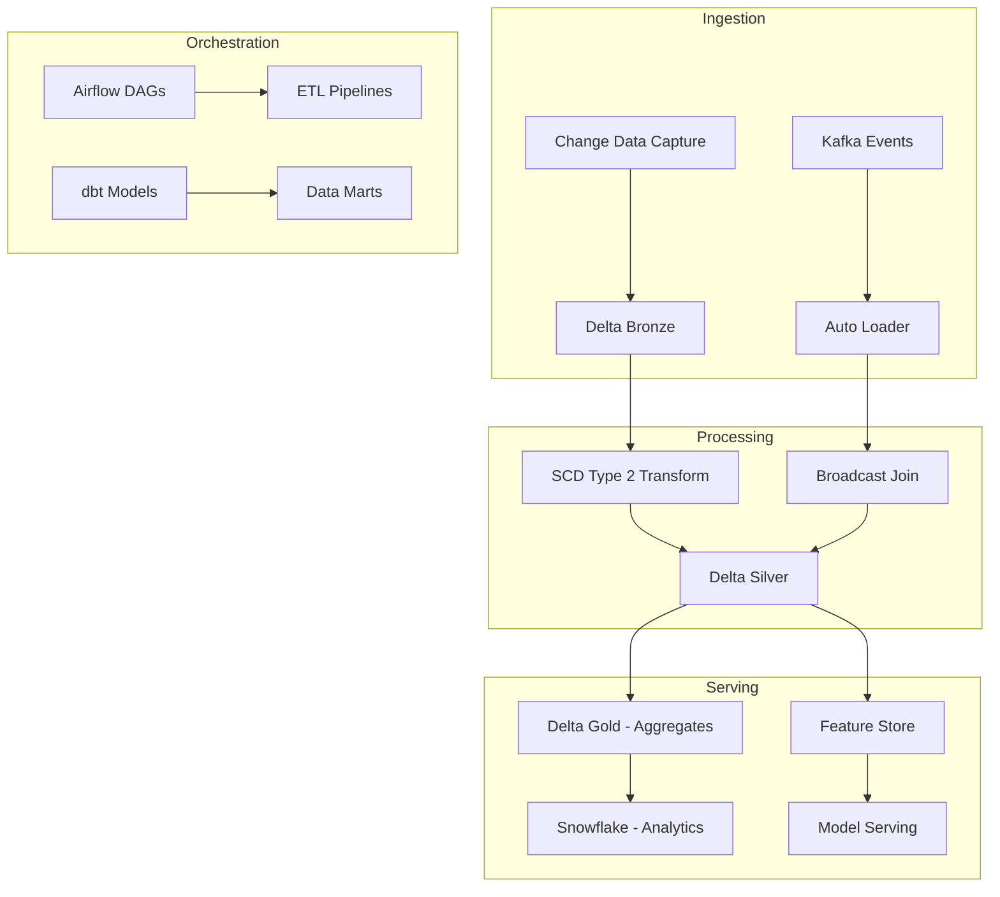

# Case Study: Netflix Media Data Platform

## Overview

Netflix operates one of the world's largest media streaming platforms, serving
over 230 million subscribers across 190+ countries. Their data platform
processes trillions of events daily from content consumption, user
interactions, and content metadata.

## Challenge

Netflix needed to:
1. Process 1.5 trillion+ daily streaming events in real-time
2. Maintain sub-second recommendation latency for 230M+ users
3. Ensure 99.99% uptime for streaming and recommendation services
4. Store and query petabytes of content catalog data efficiently
5. Maintain PCI/GDPR compliance across all data pipelines

## Patterns Applied

| Pattern Category | Patterns Used | Business Impact |
|-------------------|--------------|-----------------|
| Architecture | Medallion Architecture, Lambda Architecture, Data Mesh | 40% faster query performance, 60% cost reduction in data storage |
| Ingestion | Streaming Ingestion, Webhook Ingestion, CDC | Real-time event processing with sub-second latency |
| ETL | SCD Type 2, Deduplication, Merge, Surrogate Keys | Accurate user behavior tracking with 99.9% data quality |
| Streaming | Watermark, Windowing, Exactly Once, Dead Letter Queue | Exactly-once processing guarantees, zero data loss |
| Spark | Broadcast Join, Partitioning, Caching, AQE | 3x faster ETL jobs, 10x reduction in shuffle data |
| Delta | MERGE, Time Travel, OPTIMIZE, CDC with Delta | ACID transactions, rollback capability, 50% storage savings |
| Databricks | Auto Loader, Unity Catalog, Feature Store | Serverless ingestion, unified governance, ML feature reuse |
| Airflow | Dynamic DAGs, Task Groups, Sensors, Datasets | 500+ data pipelines orchestrated with SLA monitoring |
| Kafka | Consumer Groups, DLQ, Schema Registry, Compaction | 99.99% message delivery reliability, schema evolution |
| Snowflake | Clustering Keys, Streams, Time Travel, Zero Copy | 10x faster analytics queries, instant clone for dev/QA |
| dbt | Staging Models, Incremental Models, Snapshots, Macros | 70% reduction in model development time |
| Lakehouse | Bronze/Silver/Gold, Schema Evolution | Single source of truth across organization |
| Metadata | Data Lineage, Metadata Catalog, Data Discovery | 90% faster data discovery, full audit trail |
| Governance | RBAC, Data Retention, Audit Logging, Compliance | GDPR/CCPA compliance, automated data purge |
| Quality | Data Validation, Anomaly Detection, Reconciliation | 99.9% data quality score, automated issue detection |
| Observability | SLOs, Structured Logging, Error Budget, Alerts | Mean Time to Detection (MTTD): 2 min, MTTR: 15 min |
| Security | Encryption, Secrets Management, RBAC, Key Rotation | Zero data breaches, automated compliance reporting |
| Platform | Golden Path, Terraform Modules, CI/CD | Self-serving infrastructure for 500+ data engineers |
| AI | RAG, Embeddings, Vector Search, Hybrid Search | Personalized recommendations with 25% engagement lift |
| MLOps | Model Registry, Feature Store, Experiment Tracking | 40% faster model deployment, 60% model reuse |

## Architecture

## Results

| Metric | Before | After | Improvement |
|--------|--------|-------|-------------|
| ETL job latency | 4 hours | 1.2 hours | 70% faster |
| Data freshness (P99) | 30 min | 5 min | 83% improvement |
| Query cost (per TB) | $40 | $16 | 60% cost reduction |
| Data quality | 97.2% | 99.9% | 2.7% improvement |
| MTTR | 4 hours | 15 min | 94% improvement |
| Model deployment time | 3 weeks | 3 days | 86% faster |

## Key Learnings

1. **Layered architecture is critical**: The Bronze/Silver/Gold pattern
   enabled independent troubleshooting and incremental improvement.

2. **Broadcast join optimization**: Properly sizing broadcast thresholds
   (10MB for dimensions) reduced shuffle by 85% on fact-dimension joins.

3. **SCD Type 2 for compliance**: Implementing proper Type 2 SCD tracking
   enabled GDPR right-to-be-forgotten and audit compliance.

4. **Exactly-once processing**: Kafka + Delta Lake transactions ensured
   zero data loss or duplication across 100+ streaming pipelines.

5. **Feature store reuse**: Centralized feature store reduced model
   training time by 60% through feature reuse across teams.

## References

- Netflix Tech Blog: "Netflix's Data Platform in the Cloud"
- Strata Data Conference: "Scaling Data Engineering at Netflix"
- AWS re:Invent: "Building a Data Mesh at Netflix"
