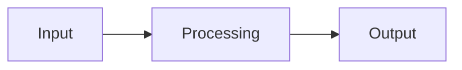

# Data Transformation in Warehouse Pattern

## Business Problem

[Describe the specific business problem this pattern addresses]

## Context

[Describe the context, when to use this pattern, and the forces at play]

## Architecture

### Components

[List and describe the key components]

## Decision Criteria

[When to use this pattern vs alternatives]

## Key Decisions

| Decision | Choice | Rationale |
|----------|--------|-----------|
| [Factor] | [Choice] | [Why this choice] |

## Advantages

- [Advantage 1]
- [Advantage 2]

## Limitations

- [Limitation 1]
- [Limitation 2]

## Performance Considerations

[Performance implications and optimization tips]

## Security Considerations

[Security implications and best practices]

## Cost Considerations

[Cost implications and optimization strategies]

## Operational Guidance

[Operational best practices, monitoring, alerting]

## Anti-patterns

[List common misuse scenarios and how to avoid them]

## Real Enterprise Use Cases

[List real enterprise use cases]

## References

[List references and further reading]
