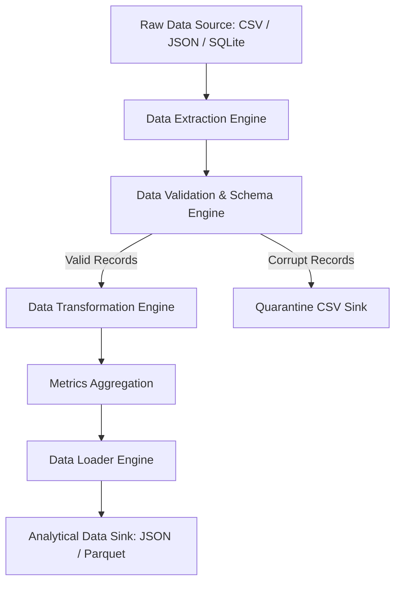
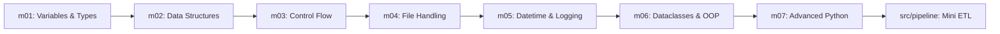
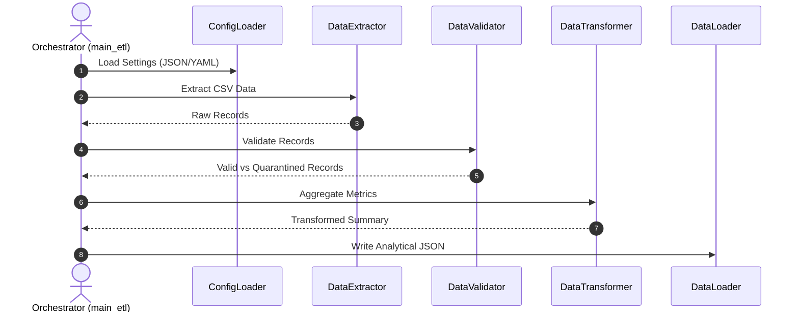

# Architecture Diagrams (Mermaid)

## 1. Python Execution Flow in Data Engineering

```mermaid
graph TD
    A[Raw Data Source: CSV / JSON / SQLite] --> B[Data Extraction Engine]
    B --> C[Data Validation & Schema Engine]
    C -->|Valid Records| D[Data Transformation Engine]
    C -->|Corrupt Records| E[Quarantine CSV Sink]
    D --> F[Metrics Aggregation]
    F --> G[Data Loader Engine]
    G --> H[Analytical Data Sink: JSON / Parquet]
```

## 2. Module Relationships & Dependency Hierarchy

```mermaid
graph LR
    m01[m01: Variables & Types] --> m02[m02: Data Structures]
    m02 --> m03[m03: Control Flow]
    m03 --> m04[m04: File Handling]
    m04 --> m05[m05: Datetime & Logging]
    m05 --> m06[m06: Dataclasses & OOP]
    m06 --> m07[m07: Advanced Python]
    m07 --> Pipeline[src/pipeline: Mini ETL]
```

## 3. Mini ETL Pipeline Data Flow

```mermaid
sequenceDiagram
    autonumber
    actor User as Orchestrator (main_etl)
    participant Config as ConfigLoader
    participant Ext as DataExtractor
    participant Val as DataValidator
    participant Trans as DataTransformer
    participant Load as DataLoader

    User->>Config: Load Settings (JSON/YAML)
    User->>Ext: Extract CSV Data
    Ext-->>User: Raw Records
    User->>Val: Validate Records
    Val-->>User: Valid vs Quarantined Records
    User->>Trans: Aggregate Metrics
    Trans-->>User: Transformed Summary
    User->>Load: Write Analytical JSON
```
