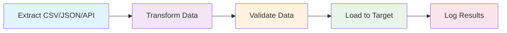
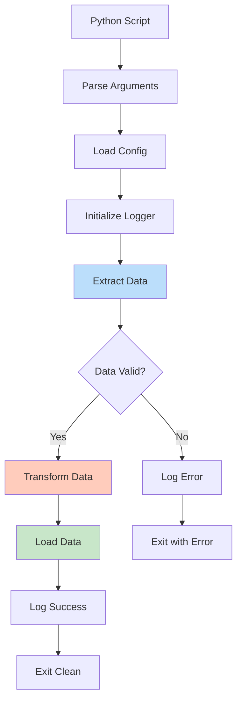

# ETL Flow Diagram



# Python Execution Flow



# Module Relationships

```mermaid
graph TD
    A[main.py] --> B[config.py]
    A --> C[logger.py]
    A --> D[models.py]
    A --> E[examples.py]

    B --> F[.env]
    B --> G[YAML Configs]

    C --> H[stdout]
    C --> I[log files]

    style A fill:#f5f5f5,stroke:#333,stroke-width:2px