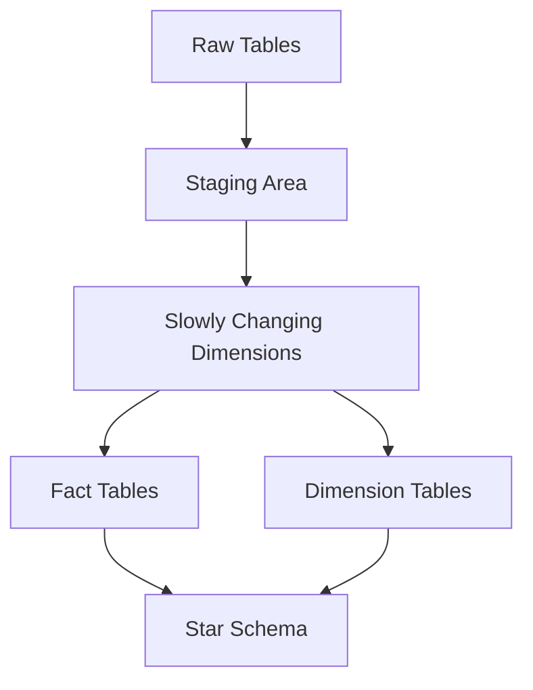

# 02 - SQL for Data Engineering

[]()
[]()

> **Project 02 in Production Data Engineering Projects**  
> Complete SQL fundamentals course designed specifically for data engineering workflows.

---

## 📚 Table of Contents

- [Overview](#-overview)
- [Learning Objectives](#-learning-objectives)
- [Prerequisites](#-prerequisites)
- [Installation](#-installation)
- [Project Structure](#-project-structure)
- [Topics Covered](#-topics-covered)
- [Running SQL Scripts](#-running-sql-scripts)
- [Warehouse Concepts](#-warehouse-concepts)
- [Exercises](#-exercises)
- [Solutions](#-solutions)
- [Architecture](#-architecture)
- [Best Practices](#-best-practices)
- [Interview Questions](#-interview-questions)
- [References](#-references)

---

## 🎯 Overview

This project teaches SQL from a **data engineering perspective**, covering essential concepts through real-world examples:

- Building ETL pipelines with SQL
- Data warehouse modeling (Star/Snowflake schemas)
- Slowly Changing Dimensions (SCD)
- Change Data Capture (CDC)
- Query optimization and performance tuning
- Data quality validation with SQL

---

## 🎓 Learning Objectives

By completing this project, you will be able to:

1. Write production-quality SQL for ETL pipelines
2. Design star and snowflake schemas for data warehouses
3. Implement Slowly Changing Dimensions (Type 1, 2, 3)
4. Build incremental data loading patterns
5. Optimize queries for large datasets
6. Validate data quality using SQL
7. Understand query execution plans and indexing

---

## 📦 Prerequisites

- Basic SQL knowledge
- PostgreSQL or compatible database (MySQL, SQL Server, Snowflake)
- Understanding of data modeling concepts

---

## 🔧 Installation

```bash
# Navigate to project directory
cd projects/02_sql_for_data_engineering

# Load sample data into PostgreSQL
psql -U postgres -f datasets/*.sql
```

---

## 📁 Project Structure

```
02_sql_for_data_engineering/
├── README.md              # This file
├── architecture.md        # Star/Snowflake schema diagrams
├── design-decisions.md    # Modeling decisions
├── performance.md         # Optimization strategies
├── troubleshooting.md      # Common issues
├── interview-questions.md  # Interview prep
├── requirements.txt        # Dependencies (none - SQL only)
├── datasets/
│   ├── customers.sql
│   ├── orders.sql
│   ├── products.sql
│   └── ...
├── schemas/
│   ├── star_schema.sql
│   └── snowflake_schema.sql
├── scripts/
│   ├── etl_full_load.sql
│   ├── etl_incremental.sql
│   ├── scd_type1.sql
│   ├── scd_type2.sql
│   └── scd_type3.sql
├── queries/
│   ├── 01_sql_fundamentals.sql
│   ├── 02_select.sql
│   ├── 03_where.sql
│   ├── ...
│   └── 55_etl_patterns.sql
├── exercises/
│   └── ...
├── solutions/
│   └── ...
├── notebooks/
│   └── ...
├── images/
│   └── warehouse_architecture.md
└── tests/
    └── sql_validation.sql
```

---

## 📖 Topics Covered

| # | Topic | Business Use Case |
|---|-------|-------------------|
| 01 | SQL Fundamentals | Query basics |
| 02 | SELECT | Data extraction |
| 03 | WHERE | Data filtering |
| 04 | ORDER BY | Sorting results |
| 05 | LIMIT | Pagination |
| 06 | DISTINCT | Deduplication |
| 07 | Aliases | Readable queries |
| 08 | Aggregate Functions | Metrics calculation |
| 09 | GROUP BY | Data aggregation |
| 10 | HAVING | Filtered aggregation |
| 11 | JOINs | Data integration |
| 12 | Self Join | Hierarchical data |
| 13 | Cross Join | Cartesian products |
| 14 | UNION | Combining results |
| 15 | UNION ALL | Fast union |
| 16 | INTERSECT | Common records |
| 17 | EXCEPT | Difference queries |
| 18 | CASE | Conditional logic |
| 19 | NULL Handling | Missing data |
| 20 | COALESCE | Default values |
| 21 | CAST | Type conversion |
| 22 | Subqueries | Nested queries |
| 23 | CTE | Readable queries |
| 24 | Recursive CTE | Hierarchies |
| 25 | Window Functions | Analytics |
| 26 | Ranking Functions | Top-N queries |
| 27 | Date Functions | Time series |
| 28 | String Functions | Data cleaning |
| 29 | Numeric Functions | Calculations |
| 30-33 | Views | Abstraction layers |
| 34-36 | Transactions/ACID | Data integrity |
| 37-40 | Indexes/Partitioning | Performance |
| 41-44 | Normalization/Denormalization | Schema design |
| 45-48 | Star/Snowflake Schema | Warehouse design |
| 49-52 | Slowly Changing Dimensions | Historical tracking |
| 53-55 | CDC/Incremental Loading | Real-time sync |

---

## ▶️ Running SQL Scripts

```bash
# Load all datasets
psql -U postgres -f datasets/*.sql

# Run ETL patterns
psql -U postgres -f scripts/etl_incremental.sql

# Run tests
psql -U postgres -f tests/sql_validation.sql
```

---

## 🏗️ Architecture



---

## ✅ Best Practices

- Use ANSI SQL for portability
- Implement proper indexing strategies
- Use CTEs for readable queries
- Handle NULL values explicitly
- Use window functions for analytics
- Implement incremental loading patterns
- Validate data quality in SQL

---

## 🎯 Interview Questions

1. **Explain the difference between WHERE and HAVING**
2. **How do you implement SCD Type 2 in SQL?**
3. **What are window functions and when to use them?**
4. **How do you optimize a slow-running query?**
5. **Explain star schema vs snowflake schema**

---

## 📖 References

- [PostgreSQL Documentation](https://postgresql.org/docs/)
- [SQL Performance Explained](https://sql-performance-explained.com/)
- [The Data Warehouse Toolkit](https://www.kimballgroup.com/)

---

*Production-ready SQL fundamentals for data engineering professionals.*