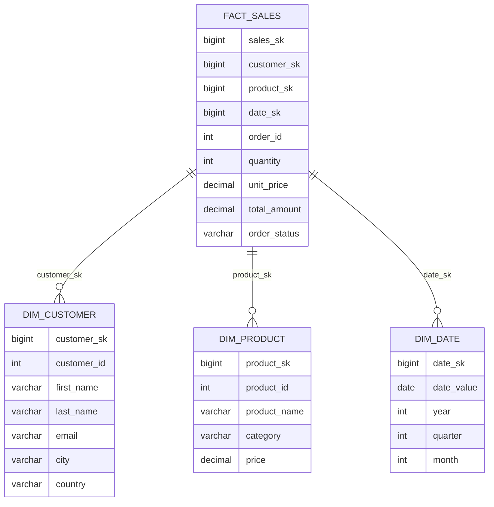
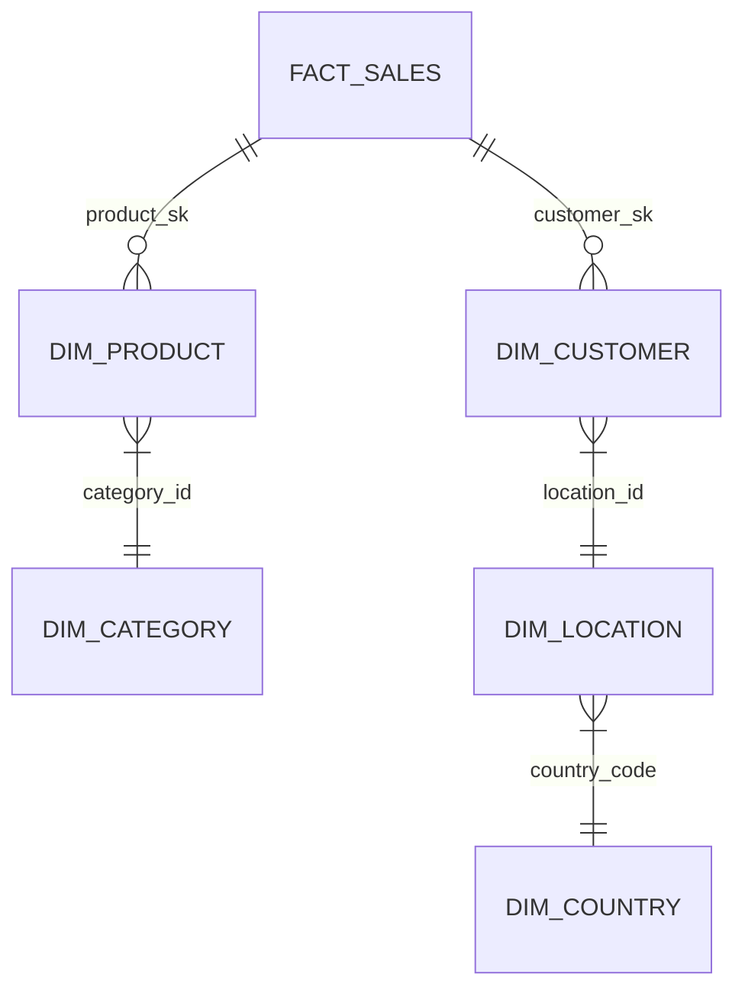
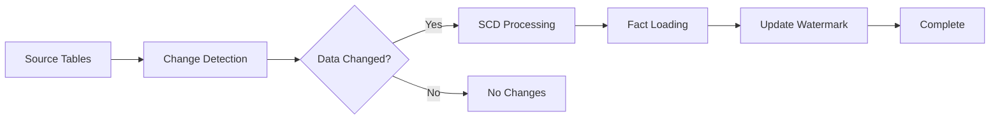

# Data Warehouse Architecture

## Star Schema



## Snowflake Schema



## Incremental ETL Flow



## Window Function Patterns

```mermaid
graph TD
    A[Base Query] --> B[ROW_NUMBER]
    A --> C[RANK/DENSE_RANK]
    A --> D[LAG/LEAD]
    A --> E[SUM OVER]
    A --> F[AVG OVER]
    A --> G[NTILE]
    
    B --> H[Pagination]
    C --> I[Top-N Analysis]
    D --> J[Trend Analysis]
    E --> K[Running Totals]
    F --> L[Moving Average]
    G --> M[Bucketing]