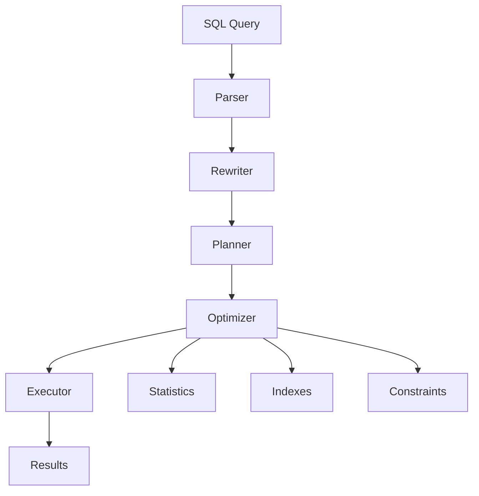

# 03 - Advanced SQL Query Optimization & Enterprise Query Engineering

[]()
[]()

> **Project 03 in Production Data Engineering Projects**  
> Enterprise-level Advanced SQL optimization for billion-row processing and production data platforms.

---

## 📚 Table of Contents

- [Overview](#-overview)
- [Learning Objectives](#-learning-objectives)
- [Prerequisites](#-prerequisites)
- [Installation](#-installation)
- [Project Structure](#-project-structure)
- [Topics Covered](#-topics-covered)
- [Running Examples](#-running-examples)
- [Architecture](#-architecture)
- [Performance Guide](#-performance-guide)
- [Best Practices](#-best-practices)
- [Interview Questions](#-interview-questions)
- [References](#-references)

---

## 🎯 Overview

This project teaches **production SQL optimization** specifically for Senior Data Engineers and Analytics Engineers working with:

- Enterprise data warehouses
- Billion-row table optimization  
- Cost-based query optimization
- Join algorithm selection
- Partition pruning strategies
- Execution plan analysis

---

## 🎓 Learning Objectives

By completing this project, you will be able to:

1. Analyze and optimize slow-running queries
2. Understand query execution plans and cost estimation
3. Implement effective indexing strategies
4. Optimize join operations for large datasets
5. Design partitioned tables for performance
6. Use materialized views effectively
7. Debug query performance issues
8. Implement incremental SQL for CDC

---

## 📦 Prerequisites

- SQL fundamentals (Project 02)
- PostgreSQL or compatible database
- Understanding of query execution concepts

---

## 🔧 Installation

```bash
# Create test data
psql -U postgres -f datasets/large_scale_data.sql

# Analyze execution plans
psql -U postgres -f execution-plans/*.sql
```

---

## 📁 Project Structure

```
03_advanced_sql_query_optimization/
├── README.md                    # This file
├── architecture.md             # Optimizer architecture
├── design-decisions.md         # Optimization decisions
├── performance.md              # Benchmark results
├── troubleshooting.md          # Performance issues
├── interview-questions.md      # Technical interview prep
├── datasets/
│   └── large_scale_data.sql   # Big data for testing
├── schemas/
│   └── optimization_schema.sql
├── queries/
│   ├── 01_execution_order.sql
│   ├── 05_explain_plans.sql
│   ├── 27_statistics.sql
│   └── 55_etl_patterns.sql
├── benchmarks/
│   ├── slow_vs_optimized.sql
│   └── performance_comparison.md
├── execution-plans/
│   └── plan_analysis.sql
├── notebooks/
│   └── query_optimization.ipynb
├── tests/
│   └── optimization_tests.sql
├── images/
│   └── optimizer_architecture.md
├── optimization/
│   ├── indexing_strategies.sql
│   ├── join_optimization.sql
│   └── query_refactoring.sql
├── monitoring/
│   └── slow_query_detection.sql
├── profiling/
│   └── query_profiler.sql
└── performance/
    └── benchmark_results.sql
```

---

## 📖 Topics Covered

| # | Topic | Business Use Case |
|---|-------|-------------------|
| 01 | Query Execution Order | Understanding plan generation |
| 02 | Cost Based Optimizer | Query cost estimation |
| 03 | Cardinality Estimation | Row count prediction |
| 04 | Query Planner | Execution strategy selection |
| 05 | Explain Plans | Query analysis |
| 06 | Analyze Plans | Performance tuning |
| 07 | Index Selection | Fast lookups |
| 08 | Composite Indexes | Multi-column queries |
| 09 | Covering Indexes | Index-only scans |
| 10 | Partial Indexes | Filtered indexing |
| 11 | Clustered Indexes | Physical ordering |
| 12 | Non Clustered Indexes | Separate storage |
| 13 | Bitmap Indexes | Data warehouse queries |
| 14 | Predicate Pushdown | Filter optimization |
| 15 | Join Optimization | Large table joins |
| 16 | Join Algorithms | Hash, Merge, Nested Loop |
| 17 | Hash Join | Equality joins |
| 18 | Merge Join | Sorted data joins |
| 19 | Nested Loop Join | Small table joins |
| 20 | Parallel Execution | Multi-core processing |
| 21 | Partition Pruning | Skip irrelevant data |
| 22 | Table Partitioning | Data segmentation |
| 23 | Table Clustering | Physical organization |
| 24 | Materialized Views | Pre-computed results |
| 25 | Result Cache | Query caching |
| 26 | Statistics | Optimizer input |
| 27 | Histograms | Data distribution |
| 28 | Query Hints | Force strategies |
| 29 | Memory Optimization | Buffer management |
| 30 | Temporary Tables | Intermediate storage |
| 31 | CTE Optimization | Recursive queries |
| 32 | Recursive Queries | Hierarchical data |
| 33 | Window Optimization | Analytic functions |
| 34 | Aggregation Optimization | GROUP BY speed |
| 35 | DISTINCT Optimization | Deduplication |
| 36 | UNION Optimization | Set operations |
| 37 | Pagination Optimization | Large result sets |
| 38 | Top-N Queries | Ranking optimization |
| 39 | Batch Processing | Large data handling |
| 40 | Incremental SQL | Change processing |
| 41 | MERGE Optimization | Upsert patterns |
| 42 | CDC SQL | Real-time sync |
| 43 | Slowly Changing Dimension | Historical tracking |
| 44 | Fact Optimization | Star schema facts |
| 45 | Dimension Optimization | Conformed dimensions |
| 46 | Star Schema Optimization | Warehouse design |
| 47 | Snowflake Optimization | Normalized DW |
| 48 | Warehouse SQL | Analytics queries |
| 49 | Lakehouse SQL | Modern analytics |
| 50 | Delta Optimization | Delta Lake queries |
| 51 | Data Quality SQL | Validation queries |
| 52 | Audit Framework | Change tracking |
| 53 | Error Logging | Failure handling |
| 54 | SQL Monitoring | Performance tracking |
| 55 | SQL Profiling | Deep analysis |
| 56 | Deadlock Analysis | Concurrency issues |
| 57 | Locking | Row/page locks |
| 58 | Isolation Levels | Transaction safety |
| 59 | ACID Performance | Consistency speed |
| 60 | Query Refactoring | Legacy optimization |

---

## 🏗️ Architecture



---

## ⚡ Performance Guide

### Indexing Strategies
- Create indexes on filtered columns
- Use composite indexes for multi-column WHERE
- Covering indexes for SELECT * queries
- Partial indexes for filtered data

### Join Optimization
- Hash Join: Large equality joins
- Merge Join: Pre-sorted data
- Nested Loop: Small dimension tables

### Partition Pruning
- Range partitioning by date
- List partitioning by category
- Hash partitioning by ID

---

## ✅ Best Practices

- Use `EXPLAIN ANALYZE` for query planning
- Keep statistics updated (`ANALYZE`)
- Avoid SELECT * in production
- Use partition pruning where possible
- Monitor query execution time
- Use materialized views for aggregations

---

## 🎯 Interview Questions

1. **How does the cost-based optimizer work?**
2. **When to use Hash Join vs Merge Join?**
3. **How do you optimize a query with 10-table joins?**
4. **Explain partition pruning with examples.**
5. **How do you debug a slow-running query?**

---

## 📖 References

- [PostgreSQL Query Planning](https://www.postgresql.org/docs/current/planner.html)
- [SQL Performance Explained](https://sql-performance-explained.com/)
- [Use The Index, Luke](https://use-the-index-luke.com/)

---

*Enterprise SQL optimization for billion-row data platforms.*