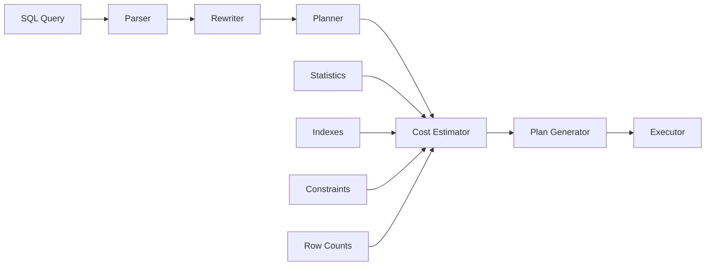
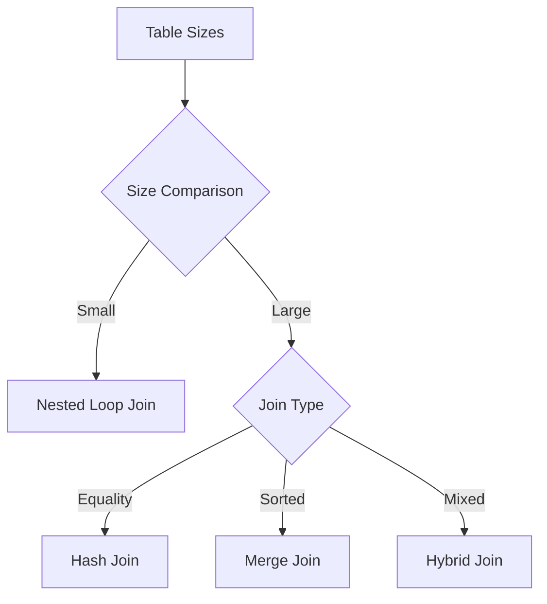
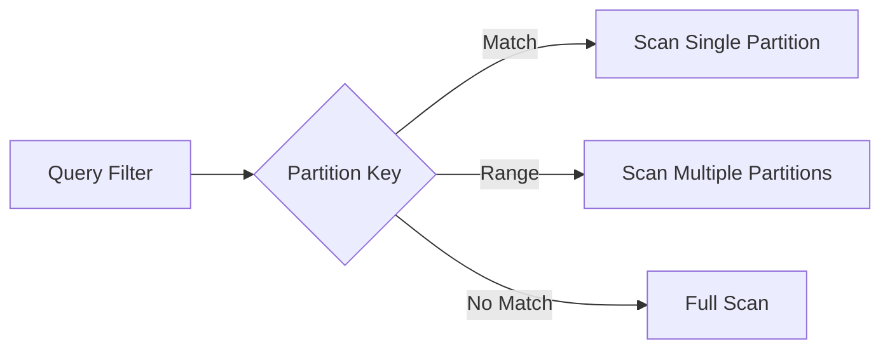
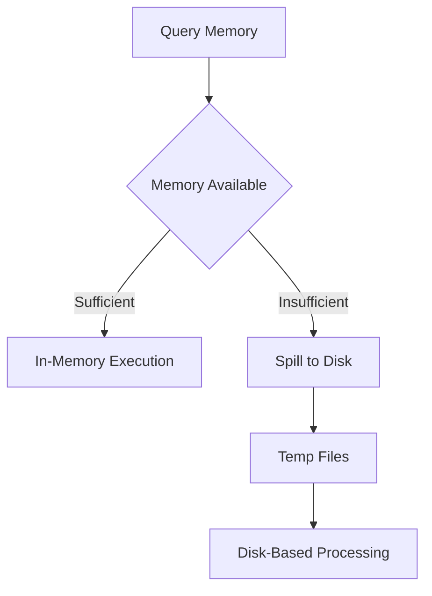

# Architecture - Advanced SQL Query Optimization

## Query Optimizer Pipeline

## Join Algorithm Selection

## Partition Pruning Strategy

## Memory Optimization Flow

## Optimizer Components

### Cost Based Optimizer (CBO)
- Uses table statistics to estimate costs
- Considers multiple execution plans
- Chooses plan with lowest estimated cost
- Updates statistics regularly

### Index Selection
- B-tree indexes for range queries
- Hash indexes for equality lookups
- GiST indexes for geometric/data search
- BRIN indexes for large sorted tables

### Join Strategies
- **Hash Join**: Build hash table on smaller table
- **Merge Join**: Sort both tables, merge results
- **Nested Loop**: For each row in outer, scan inner

### Partition Pruning
- Range partitioning: Date, numeric ranges
- List partitioning: Categorical values
- Hash partitioning: Even data distribution
- Skip irrelevant partitions at query time