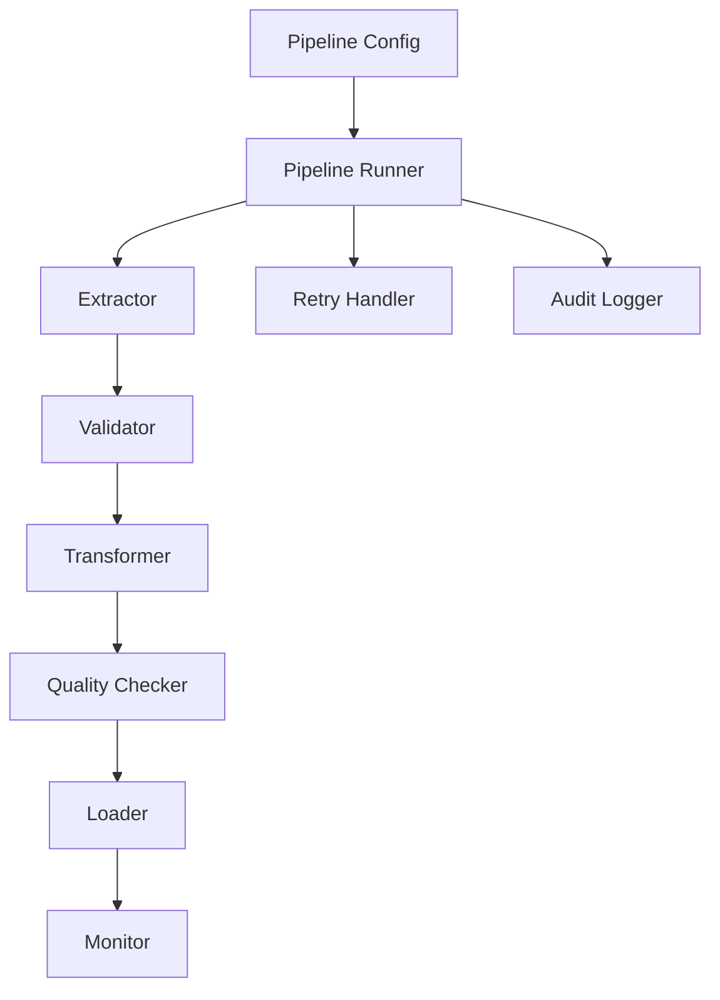

# 04 - Enterprise Python ETL Framework

[]() []()

> **Project 04 in Production Data Engineering Projects**  
> Production-ready modular ETL framework for enterprise data engineering teams.

---

## 📚 Table of Contents

- [Overview](#-overview)
- [Architecture](#-architecture)
- [Folder Structure](#-folder-structure)
- [Modules](#-modules)
- [Configuration](#-configuration)
- [Usage](#-usage)
- [Testing](#-testing)
- [Best Practices](#-best-practices)

---

## 🎯 Overview

Enterprise-grade Python ETL framework with:

- Clean architecture with separation of concerns
- Configuration-driven pipelines
- Modular, reusable components
- Comprehensive error handling and retry logic
- Structured logging and audit trails
- Data quality validation
- Performance monitoring

---

## 🏗️ Architecture



---

## 📁 Folder Structure

```
04_python_etl_framework/
├── README.md
├── pyproject.toml
├── requirements.txt
├── configs/
│   ├── pipeline.yaml      # Pipeline definitions
│   ├── database.yaml      # Database connections
│   └── logging.yaml       # Logging configuration
├── src/
│   ├── __init__.py
│   ├── core/
│   │   ├── pipeline.py    # Pipeline orchestration
│   │   └── context.py     # Execution context
│   ├── extract/
│   │   ├── csv_reader.py
│   │   ├── json_reader.py
│   │   ├── api_extractor.py
│   │   └── db_extractor.py
│   ├── transform/
│   │   ├── cleaner.py
│   │   ├── validator.py
│   │   ├── enricher.py
│   │   └── standardizer.py
│   ├── load/
│   │   ├── db_loader.py
│   │   └── file_loader.py
│   ├── monitoring/
│   │   └── metrics.py
│   └── utils/
│       ├── config.py
│       └── logger.py
├── tests/
├── datasets/
└── notebooks/
```

---

## 🔧 Usage

```python
from etl_framework.core.pipeline import Pipeline
from etl_framework.extract.csv_reader import CSVReader
from etl_framework.load.db_loader import DatabaseLoader

# Define pipeline
pipeline = Pipeline(
    name="customer_etl",
    extractor=CSVReader(path="data/customers.csv"),
    loader=DatabaseLoader(table="dim_customers")
)

# Run pipeline
pipeline.run()
```

---

## ✅ Features

- **Modular Design**: Pluggable extractors, transformers, loaders
- **Configuration Driven**: No hardcoded values
- **Enterprise Logging**: Structured JSON logs
- **Data Quality**: Schema validation, null checks, business rules
- **Retry Logic**: Configurable retry with exponential backoff
- **Audit Trail**: Complete execution history
- **Monitoring**: Metrics collection and alerting

---

*Enterprise Python ETL framework for production data pipelines.*