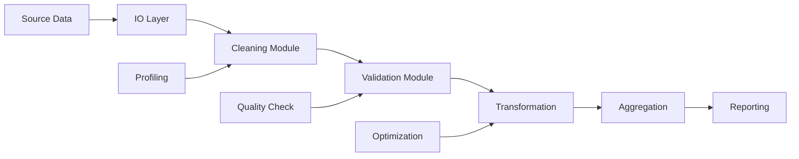

# 05 - Enterprise Pandas for Data Engineering

[]() []() []()

> **Project 05 in Production Data Engineering Projects**  
> Production-grade Pandas implementation for enterprise data engineering workflows.

---

## 📚 Table of Contents

- [Overview](#-overview)
- [Architecture](#-architecture)
- [Folder Structure](#-folder-structure)
- [Modules](#-modules)
- [Business Scenarios](#-business-scenarios)
- [Optimization](#-optimization)
- [Usage](#-usage)
- [Best Practices](#-best-practices)

---

## 🎯 Overview

Enterprise Pandas patterns for:

- Large-scale data processing (billion-row datasets)
- Memory optimization and chunked processing
- Data cleaning and validation pipelines
- Feature engineering for machine learning
- Production reporting and analytics
- Data quality frameworks

---

## 🏗️ Architecture



---

## 📁 Folder Structure

```
05_enterprise_pandas_data_engineering/
├── README.md
├── architecture.md
├── design-decisions.md
├── troubleshooting.md
├── interview-questions.md
├── pyproject.toml
├── requirements.txt
├── configs/
├── datasets/
├── notebooks/
├── scripts/
├── src/
│   ├── io/
│   ├── cleaning/
│   ├── validation/
│   ├── transformation/
│   ├── aggregation/
│   ├── quality/
│   ├── profiling/
│   ├── optimization/
│   ├── reporting/
│   ├── pipelines/
│   └── utils/
├── tests/
├── benchmarks/
├── docs/
└── images/
```

---

## 🔧 Modules

### IO Module
- `csv_reader.py` - Efficient CSV reading with chunking
- `json_reader.py` - JSON parsing with schema validation
- `parquet_reader.py` - Columnar storage for analytics
- `excel_reader.py` - Excel file processing

### Cleaning Module
- `duplicates.py` - Deduplication strategies
- `nulls.py` - Missing value handling
- `standardization.py` - Data format standardization
- `outliers.py` - Outlier detection and treatment

### Validation Module
- `schema.py` - Schema validation
- `business_rules.py` - Business rule enforcement
- `constraints.py` - Data constraint checking

### Transformation Module
- `feature_engineering.py` - Feature creation
- `encoding.py` - Categorical encoding
- `scaling.py` - Numeric scaling
- `datetime.py` - Date/time transformations

---

## 💼 Business Scenarios

- Customer Master Data Cleansing
- Order Processing and Validation
- Sales Reporting Pipelines
- Payment Transaction Processing
- Healthcare Claims Validation
- IoT Sensor Data Aggregation

---

## ⚡ Optimization

- Vectorization over apply()
- Categorical data types
- Chunk processing for large files
- Efficient merge/join strategies
- Memory reduction techniques
- Index optimization

---

*Enterprise Pandas for production data engineering.*