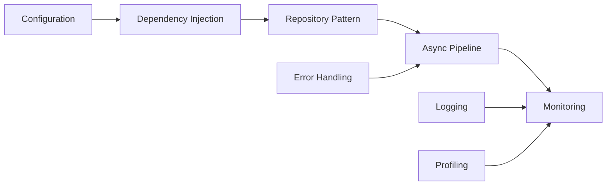

# 06 - Advanced Python for Enterprise Data Engineering

[]() []()

> **Project 06 in Production Data Engineering Projects**  
> Production-grade Advanced Python patterns for data engineering workflows.

---

## 📚 Table of Contents

- [Overview](#-overview)
- [Architecture](#-architecture)
- [Folder Structure](#-folder-structure)
- [Modules](#-modules)
- [Patterns](#-patterns)
- [Performance](#-performance)
- [Usage](#-usage)

---

## 🎯 Overview

Advanced Python patterns for production data engineering:

- SOLID Principles
- Design Patterns (Repository, Factory, Strategy)
- Dependency Injection
- Async IO with aiohttp
- Concurrency with ThreadPoolExecutor
- Configuration Management
- Structured Logging

---

## 🏗️ Architecture



---

## 📁 Folder Structure

```
06_advanced_python_data_engineering/
├── README.md
├── architecture.md
├── design-decisions.md
├── troubleshooting.md
├── interview-questions.md
├── pyproject.toml
├── requirements.txt
├── configs/
├── src/
│   ├── core/
│   ├── design_patterns/
│   ├── async/
│   ├── concurrency/
│   ├── configuration/
│   ├── logging/
│   ├── monitoring/
│   ├── performance/
│   ├── profiling/
│   ├── packaging/
│   └── utils/
├── tests/
├── benchmarks/
└── docs/
```

---

## 🔧 Modules

### Core Module
- `context.py` - Execution context management
- `pipeline.py` - Pipeline orchestration
- `base.py` - Base classes and interfaces

### Design Patterns
- `repository.py` - Repository pattern for data sources
- `factory.py` - Factory for component creation
- `strategy.py` - Strategy pattern for algorithms
- `singleton.py` - Singleton for shared resources

### Async Module
- `http_client.py` - Async HTTP client with retry
- `file_processor.py` - Async file processing
- `stream.py` - Async data streaming

### Concurrency
- `thread_pool.py` - Thread-based parallelism
- `process_pool.py` - Multiprocessing patterns
- `producer_consumer.py` - Queue processing

### Configuration
- `yaml_config.py` - YAML configuration loader
- `env_manager.py` - Environment variable management
- `secrets.py` - Secrets handling

---

*Enterprise Advanced Python for production data engineering.*