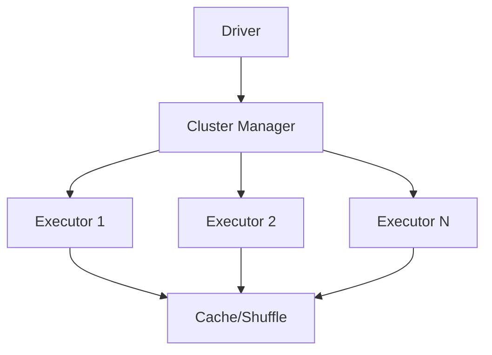

# 07 - Enterprise PySpark for Data Engineering

[]() []() []()

> **Project 07 in Production Data Engineering Projects**  
> Production-grade PySpark implementation for enterprise data engineering workflows.

---

## 📚 Table of Contents

- [Overview](#-overview)
- [Spark Architecture](#-spark-architecture)
- [Folder Structure](#-folder-structure)
- [Modules](#-modules)
- [Optimization](#-optimization)
- [File Formats](#-file-formats)
- [Usage](#-usage)

---

## 🎯 Overview

Enterprise PySpark patterns for:

- Distributed computing with Spark clusters
- Billion-row dataset processing
- Performance optimization (Catalyst, Tungsten, AQE)
- Enterprise ETL pipelines
- Data quality frameworks
- Production deployment patterns

---

## ⚙️ Spark Architecture



---

## 📁 Folder Structure

```
07_enterprise_pyspark/
├── README.md
├── architecture.md
├── design-decisions.md
├── pyproject.toml
├── requirements.txt
├── configs/
├── src/
│   ├── spark/session.py
│   ├── readers/csv_reader.py
│   ├── readers/parquet_reader.py
│   ├── writers/parquet_writer.py
│   ├── transformations/cleaning.py
│   ├── transformations/aggregation.py
│   ├── optimization/broadcast.py
│   ├── optimization/partitioning.py
│   ├── validation/schema.py
│   └── pipelines/etl.py
├── tests/
├── benchmarks/
└── notebooks/
```

---

## 🔧 Modules

### Spark Session
- `session.py` - Production SparkSession configuration

### Readers
- `csv_reader.py` - Optimized CSV reading
- `parquet_reader.py` - Columnar format optimization

### Writers
- `parquet_writer.py` - Efficient Parquet writing

### Transformations
- `cleaning.py` - Data cleaning patterns
- `aggregation.py` - GroupBy and aggregate operations

### Optimization
- `broadcast.py` - Broadcast join patterns
- `partitioning.py` - Partition and repartition strategies

---

## ⚡ Optimization

- Predicate pushdown
- Column pruning
- Partition pruning
- Broadcast joins
- Adaptive query execution
- Caching and persistence
- Memory tuning

---

*Enterprise PySpark for production data engineering.*