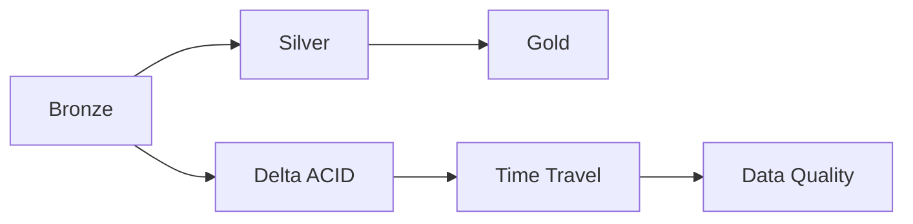

# 08 - Enterprise Delta Lake for Data Engineering

[]() []() []()

> **Project 08 in Production Data Engineering Projects**  
> Production-grade Delta Lake implementation for lakehouse architecture.

---

## 📚 Table of Contents

- [Overview](#-overview)
- [Architecture](#-architecture)
- [Folder Structure](#-folder-structure)
- [Modules](#-modules)
- [Optimization](#-optimization)
- [Usage](#-usage)

---

## 🎯 Overview

Enterprise Delta Lake patterns for:

- Lakehouse architecture
- ACID transactions on data lakes
- Time travel and versioning
- Schema enforcement
- MERGE operations
- Change data feed
- Data quality with constraints

---

## ⚙️ Architecture



---

## 📁 Folder Structure

```
08_delta_lake/
├── README.md
├── architecture.md
├── design-decisions.md
├── pyproject.toml
├── requirements.txt
├── src/
│   ├── readers/
│   ├── writers/
│   ├── transformations/
│   ├── optimization/
│   └── pipelines/
├── tests/
└── notebooks/
```

---

## 🔧 Modules

### Readers
- `delta_reader.py` - Optimized Delta read with partitioning

### Writers
- `delta_writer.py` - ACID-compliant writes
- `merge_writer.py` - MERGE operations

### Transformations
- `bronze_to_silver.py` - Data cleansing
- `silver_to_gold.py` - Data aggregation

### Optimization
- `vacuum.py` - File cleanup
- `optimize.py` - Z-Order indexing
- `time_travel.py` - Version querying

---

*Enterprise Delta Lake for lakehouse architecture.*