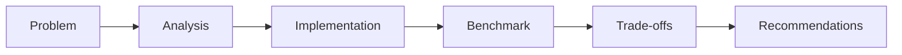

# 08 - PySpark Performance Engineering

[]() []() []()

> **Project 08 in Production Data Engineering Projects**  
> Production-grade PySpark performance optimization for large-scale data processing.

---

## 📚 Table of Contents

- [Overview](#-overview)
- [Performance Concepts](#-performance-concepts)
- [Folder Structure](#-folder-structure)
- [Modules](#-modules)
- [Spark UI Analysis](#-spark-ui-analysis)
- [Optimization Guide](#-optimization-guide)

---

## 🎯 Overview

Performance optimization for Spark jobs processing billions of rows:

- DAG and stage optimization
- Shuffle and memory tuning
- Join strategy selection
- Skew detection and handling
- Cluster resource optimization
- Production monitoring

---

## ⚡ Performance Concepts



---

## 📁 Folder Structure

```
08_pyspark_performance_engineering/
├── README.md
├── architecture.md
├── optimization-guide.md
├── troubleshooting.md
├── benchmarks/
├── spark-ui/
├── src/
│   ├── optimization/
│   ├── partitioning/
│   ├── joins/
│   ├── memory/
│   ├── caching/
│   └── profiling/
└── tests/
```

---

## 🔧 Modules

### Optimization
- `broadcast_optimization.py` - Join strategy optimization
- `partition_optimization.py` - Partition sizing and coalescing
- `aqe_tuning.py` - Adaptive query execution

### Profiling
- `spark_ui_analyzer.py` - Spark UI interpretation
- `stage_profiler.py` - Stage analysis
- `shuffle_profiler.py` - Shuffle optimization

---

*Production Performance Engineering for PySpark.*