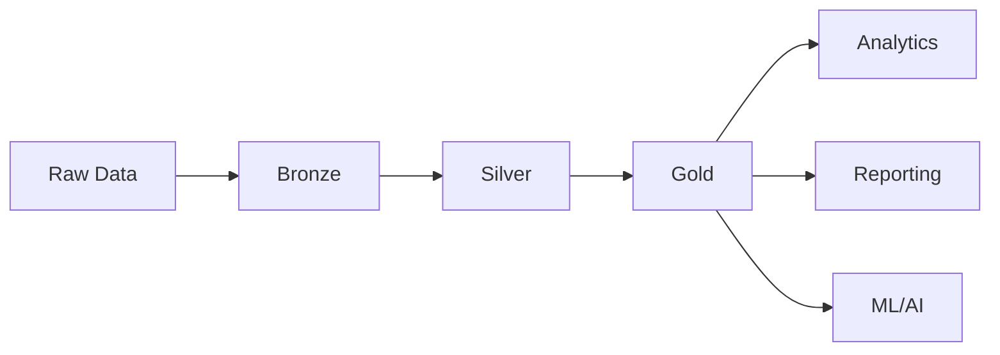

# 09 - Enterprise Delta Lake & Lakehouse Engineering

[]() []() []()

> **Project 09 in Production Data Engineering Projects**  
> World-class Delta Lake implementation for enterprise lakehouse architecture.

---

## 📚 Table of Contents

- [Overview](#-overview)
- [Lakehouse Architecture](#-lakehouse-architecture)
- [Medallion Architecture](#-medallion-architecture)
- [Folder Structure](#-folder-structure)
- [Modules](#-modules)
- [Delta Features](#-delta-features)

---

## 🎯 Overview

Enterprise Delta Lake patterns for:

- ACID transactions on data lakes
- Time travel and versioning
- Schema enforcement and evolution
- Medallion architecture (Bronze/Silver/Gold)
- Change Data Feed (CDC)
- Performance optimization

---

## ⚙️ Lakehouse Architecture



---

## 📁 Folder Structure

```
09_enterprise_delta_lake/
├── README.md
├── lakehouse-design.md
├── medallion-architecture.md
├── src/
│   ├── bronze/
│   ├── silver/
│   ├── gold/
│   ├── delta/
│   ├── optimization/
│   ├── merge/
│   ├── cdc/
│   └── quality/
├── tests/
└── notebooks/
```

---

## 🔧 Modules

### Bronze Layer
- Raw data ingestion
- Schema enforcement
- Audit columns

### Silver Layer
- Data cleansing
- Deduplication
- Business rules

### Gold Layer
- Aggregations
- Star schemas
- Reporting tables

---

*Enterprise Lakehouse Architecture.*