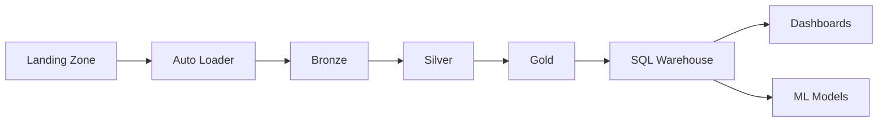

# 10 - Enterprise Databricks Lakehouse Platform

[]() []() []()

> **Project 10 in Production Data Engineering Projects**  
> Complete enterprise-grade Databricks Lakehouse platform.

---

## 📚 Table of Contents

- [Overview](#-overview)
- [Lakehouse Architecture](#-lakehouse-architecture)
- [Folder Structure](#-folder-structure)
- [Modules](#-modules)
- [Enterprise Features](#-enterprise-features)

---

## 🎯 Overview

Databricks platform patterns for:

- Workspace design
- Unity Catalog
- Auto Loader
- Delta Live Tables
- Workflows and Jobs
- CI/CD deployment
- Cost optimization

---

## ⚙️ Lakehouse Architecture



---

## 📁 Folder Structure

```
10_enterprise_databricks_lakehouse/
├── README.md
├── architecture.md
├── deployment-guide.md
├── src/
│   ├── autoloader/
│   ├── dlt/
│   ├── workflows/
│   ├── jobs/
│   └── unity_catalog/
├── configs/
├── tests/
└── cicd/
```

---

## 🔧 Modules

### Auto Loader
- CloudFiles ingestion
- Schema evolution
- Incremental processing

### DLT
- Streaming tables
- Materialized views
- Expectations

### Workflows
- Job orchestration
- Task dependencies
- Parameters

---

*Enterprise Databricks Lakehouse Platform.*