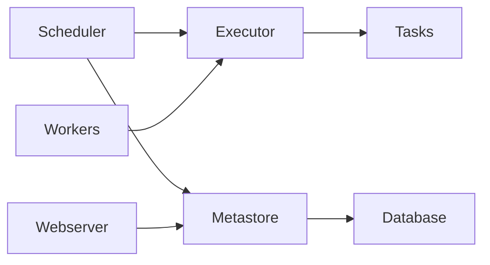

# 11 - Enterprise Apache Airflow Workflow Orchestration

[]() []() []()

> **Project 11 in Production Data Engineering Projects**  
> Enterprise-grade Apache Airflow workflow orchestration.

---

## 📚 Table of Contents

- [Overview](#-overview)
- [Airflow Architecture](#-airflow-architecture)
- [Folder Structure](#-folder-structure)
- [Modules](#-modules)
- [Enterprise Features](#-enterprise-features)

---

## 🎯 Overview

Apache Airflow patterns for enterprise:

- DAG design and orchestration
- TaskFlow API
- Dynamic DAG generation
- Custom operators and hooks
- Production deployment
- Monitoring and alerting

---

## ⚙️ Airflow Architecture



---

## 📁 Folder Structure

```
11_enterprise_apache_airflow/
├── README.md
├── architecture.md
├── dags/
│   ├── beginner/
│   ├── intermediate/
│   ├── advanced/
│   ├── enterprise/
│   └── dynamic/
├── plugins/
├── operators/
├── hooks/
├── sensors/
├── tests/
└── docker/
```

---

## 🔧 Modules

### DAG Design
- TaskFlow API patterns
- Task groups
- Dynamic task mapping
- Best practices

### Operators
- Custom operators
- Spark Submit Operator
- Databricks Operator
- SQL Operators

### Deployment
- Docker Compose
- Celery Executor
- Kubernetes Executor

---

*Enterprise Apache Airflow Orchestration.*