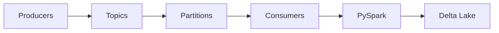

# 12 - Enterprise Apache Kafka & Event-Driven Data Engineering

[]() []() []()

> **Project 12 in Production Data Engineering Projects**  
> Enterprise-grade Apache Kafka for event-driven data platforms.

---

## 📚 Table of Contents

- [Overview](#-overview)
- [Kafka Architecture](#-kafka-architecture)
- [Folder Structure](#-folder-structure)
- [Modules](#-modules)
- [Enterprise Features](#-enterprise-features)

---

## 🎯 Overview

Apache Kafka patterns for enterprise:

- Event-driven architecture
- Producers and consumers
- Schema Registry
- Kafka Connect
- Monitoring and performance
- Security

---

## ⚙️ Kafka Architecture



---

## 📁 Folder Structure

```
12_enterprise_apache_kafka/
├── README.md
├── architecture.md
├── producers/
├── consumers/
├── connect/
├── schemas/
├── monitoring/
├── tests/
└── docker/
```

---

## 🔧 Modules

### Producers
- Producer API
- Batching and compression
- Idempotent producers
- Transactions

### Consumers
- Consumer groups
- Offset management
- Rebalancing

### Kafka Connect
- Source connectors
- Sink connectors
- DLQ patterns

---

*Enterprise Apache Kafka.*