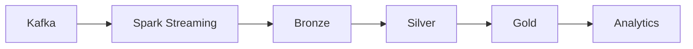

# 13 - Enterprise Spark Structured Streaming

[]() []() []()

> **Project 13 in Production Data Engineering Projects**  
> Enterprise-grade Spark Structured Streaming for real-time pipelines.

---

## 📚 Table of Contents

- [Overview](#-overview)
- [Streaming Architecture](#-streaming-architecture)
- [Folder Structure](#-folder-structure)
- [Modules](#-modules)

---

## 🎯 Overview

Real-time streaming patterns for:

- Structured Streaming pipelines
- Kafka integration
- Watermarking and windowing
- Stateful processing
- Exactly-once guarantees

---

## ⚙️ Streaming Architecture



---

## 📁 Folder Structure

```
13_enterprise_spark_structured_streaming/
├── README.md
├── src/
│   ├── kafka/
│   ├── streaming/
│   ├── watermark/
│   ├── windowing/
│   └── state/
├── tests/
└── docs/
```

---

*Enterprise Real-Time Streaming.*