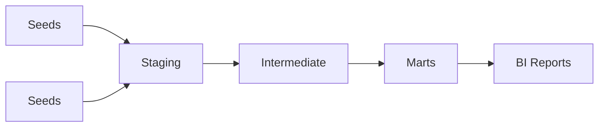

# 14 - Enterprise dbt Analytics Engineering

[]() []() []()

> **Project 14 in Production Data Engineering Projects**  
> Enterprise-grade dbt Analytics Engineering.

---

## 📚 Table of Contents

- [Overview](#-overview)
- [dbt Architecture](#-dbt-architecture)
- [Folder Structure](#-folder-structure)
- [Modules](#-modules)

---

## 🎯 Overview

Analytics Engineering patterns for:

- ELT architecture
- dbt models and materializations
- Testing and documentation
- CI/CD pipelines

---

## ⚙️ dbt Architecture



---

## 📁 Folder Structure

```
14_enterprise_dbt_analytics_engineering/
├── README.md
├── dbt_project.yml
├── models/
│   ├── staging/
│   ├── intermediate/
│   └── marts/
├── tests/
├── snapshots/
└── macros/
```

---

*Enterprise dbt Analytics Engineering.*