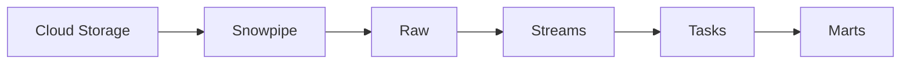

# 15 - Enterprise Snowflake Data Cloud

[]() []() []()

> **Project 15 in Production Data Engineering Projects**  
> Enterprise-grade Snowflake Data Cloud platform.

---

## 📚 Table of Contents

- [Overview](#-overview)
- [Snowflake Architecture](#-snowflake-architecture)
- [Folder Structure](#-folder-structure)
- [Modules](#-modules)

---

## 🎯 Overview

Snowflake patterns for enterprise:

- ELT architecture
- Streams and Tasks
- Snowpark DataFrames
- Governance and security
- Cost optimization

---

## ⚙️ Snowflake Architecture



---

## 📁 Folder Structure

```
15_enterprise_snowflake_data_cloud/
├── README.md
├── sql/
│   ├── streams/
│   └── tasks/
├── snowpark/
└── tests/
```

---

*Enterprise Snowflake Data Cloud.*