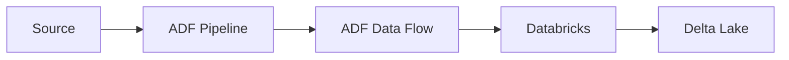

# 16 - Enterprise Azure Data Factory

[]() []() []()

> **Project 16 in Production Data Engineering Projects**  
> Enterprise-grade Azure Data Factory cloud integration.

---

## 📚 Table of Contents

- [Overview](#-overview)
- [ADF Architecture](#-adf-architecture)
- [Folder Structure](#-folder-structure)
- [Modules](#-modules)

---

## 🎯 Overview

Azure Data Factory patterns for enterprise:

- Cloud data integration
- Metadata-driven ETL
- Pipeline orchestration
- CI/CD

---

## ⚙️ ADF Architecture



---

## 📁 Folder Structure

```
16_enterprise_azure_data_factory/
├── README.md
├── adf/
│   ├── pipelines/
│   ├── datasets/
│   └── linked_services/
├── cicd/
└── tests/
```

---

*Enterprise Azure Data Factory.*