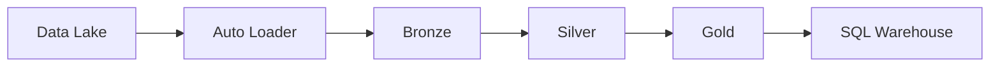

# 17 - Enterprise Azure Databricks Advanced

[]() []() []()

> **Project 17 in Production Data Engineering Projects**  
> Enterprise-grade Azure Databricks advanced engineering.

---

## 📚 Table of Contents

- [Overview](#-overview)
- [Architecture](#-architecture)
- [Folder Structure](#-folder-structure)
- [Modules](#-modules)

---

## 🎯 Overview

Azure Databricks advanced patterns for enterprise:

- Unity Catalog administration
- Lakeflow pipelines
- Asset Bundles
- Terraform deployment

---

## ⚙️ Architecture



---

## 📁 Folder Structure

```
17_enterprise_azure_databricks_advanced/
├── README.md
├── src/
│   ├── pipelines/
│   └── observability/
├── dlt/
├── terraform/
└── cicd/
```

---

*Enterprise Azure Databricks Advanced.*