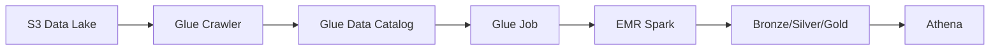

# 18 - Enterprise AWS Glue, EMR & Lake Formation

[]() []() []()

> **Project 18 in Production Data Engineering Projects**  
> Enterprise-grade AWS Data Engineering platform.

---

## 📚 Table of Contents

- [Overview](#-overview)
- [AWS Lakehouse Architecture](#-aws-lakehouse-architecture)
- [Folder Structure](#-folder-structure)
- [Modules](#-modules)

---

## 🎯 Overview

AWS Data Engineering patterns for enterprise:

- Glue crawlers and jobs
- EMR Spark processing
- Lake Formation governance
- Athena querying

---

## ⚙️ AWS Lakehouse Architecture



---

## 📁 Folder Structure

```
18_enterprise_aws_glue_emr_lakeformation/
├── README.md
├── glue/
│   ├── jobs/
│   └── crawlers/
├── emr/
├── lakeformation/
└── terraform/
```

---

*Enterprise AWS Data Engineering.*