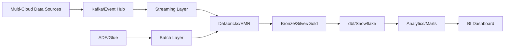

# 20 - Enterprise Modern Data Platform Capstone

[]() []() []()

> **Project 20 in Production Data Engineering Projects**  
> Enterprise-grade Modern Data Platform integrating all technologies.

---

## 📚 Table of Contents

- [Overview](#-overview)
- [Architecture](#-architecture)
- [Folder Structure](#-folder-structure)
- [Modules](#-modules)

---

## 🎯 Overview

Complete enterprise data platform with:

- Multi-cloud architecture
- Real-time and batch processing
- Lakehouse and warehouse
- Governance and observability
- AI-ready data pipelines

---

## ⚙️ Enterprise Architecture



---

## 📁 Folder Structure

```
20_enterprise_modern_data_platform_capstone/
├── README.md
├── architecture/
├── infrastructure/
├── streaming/
├── lakehouse/
├── warehouse/
├── analytics/
└── cicd/
```

---

*Enterprise Modern Data Platform Capstone.*