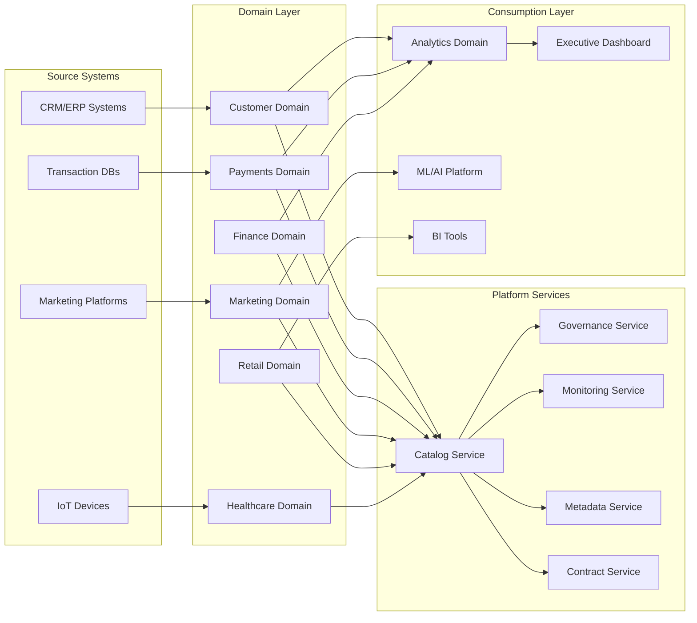
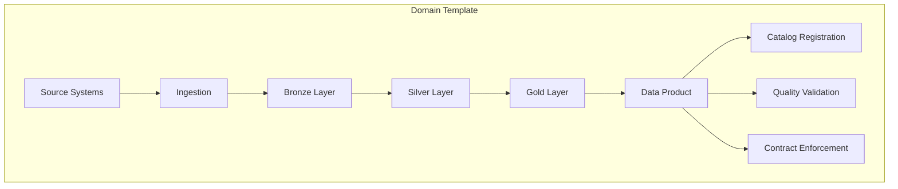
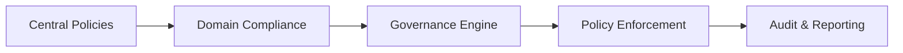

# 21 - Enterprise Data Mesh

[]() []() []()

> **Project 21 in Production Data Engineering Projects**  
> World-class Enterprise Data Mesh platform with domain-oriented architecture.

---

## 📚 Table of Contents

- [Overview](#-overview)
- [Architecture](#-architecture)
- [Domain Design](#-domain-design)
- [Platform Services](#-platform-services)
- [Folder Structure](#-folder-structure)
- [Module Guide](#-module-guide)
- [Governance](#-governance)
- [Security](#-security)
- [Observability](#-observability)
- [Deployment](#-deployment)
- [Best Practices](#-best-practices)
- [Exercises](#-exercises)
- [Solutions](#-solutions)
- [Interview Questions](#-interview-questions)
- [References](#-references)

---

## 🎯 Overview

Enterprise-grade Data Mesh platform implementing domain-oriented ownership, federated computational governance, and self-service data platform capabilities. This platform demonstrates production-ready patterns for building and operating hundreds of independent data products across multiple business domains.

### What is Data Mesh?

Data Mesh is a decentralized approach to data architecture that treats data as a product and assigns ownership to domain teams. This implementation follows four core principles:

1. **Domain-Oriented Ownership** - Data ownership aligned with business domains
2. **Data as a Product** - Each domain owns and serves data products
3. **Federated Computational Governance** - Central governance with local autonomy
4. **Self-Service Data Platform** - Platform provides tools for domain teams

### Key Features

- ✅ Multi-domain data product architecture
- ✅ Federated governance with policy-as-code
- ✅ Automated data product lifecycle management
- ✅ Cross-domain data sharing protocols
- ✅ Enterprise-grade security and compliance
- ✅ Comprehensive observability and monitoring
- ✅ Infrastructure as code (Terraform)
- ✅ CI/CD for data products

---

## ⚙️ Enterprise Architecture



---

## 📁 Folder Structure

```
21_enterprise_data_mesh/
├── README.md                    # This file
├── architecture.md             # System architecture details
├── platform-guide.md           # Platform services guide
├── governance.md               # Governance framework
├── domain-design.md            # Domain modeling guide
├── deployment-guide.md         # Deployment instructions
├── troubleshooting.md          # Common issues and solutions
├── interview-questions.md      # Interview preparation
├── platform/                 # Self-service platform services
│   ├── catalog/             # Data product catalog
│   ├── governance/          # Federated governance
│   ├── metadata/            # Metadata management
│   ├── contracts/           # Data contracts
│   ├── monitoring/          # Observability stack
│   ├── identity/            # Identity management
│   └── shared-services/     # Shared platform capabilities
├── domains/                  # Domain data products
│   ├── customer/           # Customer domain
│   ├── payments/           # Payments domain
│   ├── finance/            # Finance domain
│   ├── marketing/          # Marketing domain
│   ├── retail/             # Retail domain
│   ├── healthcare/         # Healthcare domain
│   ├── supply_chain/       # Supply chain domain
│   ├── hr/               # HR domain
│   └── analytics/          # Analytics domain
├── infrastructure/           # Terraform Infrastructure as Code
├── datasets/                 # Sample datasets
├── scripts/                  # Utility scripts
├── configs/                  # Configuration files
├── tests/                    # Test suite
├── benchmarks/               # Performance benchmarks
├── docs/                     # Additional documentation
├── diagrams/                 # Architecture diagrams
├── images/                   # Screenshots and visuals
└── cicd/                     # CI/CD pipelines
```

---

## 📦 Technology Stack

| Technology | Version | Purpose |
|------------|---------|---------|
| Python | 3.13+ | Core programming language |
| PySpark | 4.x | Distributed processing |
| Delta Lake | Latest | Lakehouse storage |
| Apache Kafka | Latest | Event streaming |
| Apache Airflow | Latest | Workflow orchestration |
| dbt | Latest | Data transformation |
| Snowflake | Latest | Cloud data warehouse |
| Databricks | Latest | Unified analytics platform |
| Terraform | Latest | Infrastructure as Code |
| Great Expectations | Latest | Data quality framework |
| OpenLineage | Latest | Lineage tracking |

---

## 📋 Module Guide

| Module | Description |
|--------|-------------|
| 01 Data Mesh Architecture | Platform architecture patterns |
| 02 Domain-Driven Design | Domain modeling principles |
| 03 Domain Ownership | Ownership models and RACI |
| 04 Data Products | Product design and patterns |
| 05 Data Product Lifecycle | Build, certify, retire |
| 06 Product Documentation | Documentation standards |
| 07 Product SLAs | Service level agreements |
| 08 Product SLOs | Service level objectives |
| 09 Product APIs | Domain API patterns |
| 10 Product Contracts | Contract validation |
| 11 Product Versioning | Semantic versioning |
| 12 Product Certification | Quality certification |
| 13 Metadata Standards | Metadata schema |
| 14 Business Metadata | Business context |
| 15 Technical Metadata | Technical schema |
| 16 Operational Metadata | Operations data |
| 17 Federated Governance | Policy framework |
| 18 Policy Enforcement | Policy engine |
| 19 Domain Security | Security model |
| 20 Domain RBAC | Role-based access |
| 21 Data Sharing | Cross-domain sharing |
| 22 Event Integration | Event-driven patterns |
| 23 Streaming Domains | Real-time domains |
| 24 Batch Domains | Batch processing |
| 25 Lakehouse Domains | Lakehouse patterns |
| 26 Domain Pipelines | Pipeline design |
| 27 Domain Monitoring | Health monitoring |
| 28 Lineage | Data lineage |
| 29 Quality Framework | Data quality |
| 30 Data Contracts | Contract lifecycle |
| 31 CI/CD | Deployment pipelines |
| 32 Platform APIs | Platform services |
| 33 Platform SDK | SDK for domains |
| 34 Self-Service Provisioning | Infrastructure automation |
| 35 Catalog Integration | Catalog services |
| 36 Cost Allocation | Cost management |
| 37 Usage Analytics | Consumption tracking |
| 38 Chargeback Concepts | Cost allocation |
| 39 Platform Reliability | SRE for data |
| 40 Incident Management | Incident response |
| 41 Disaster Recovery | DR planning |
| 42 Multi-Cloud Domains | Multi-cloud patterns |
| 43 AI-Ready Data Products | ML features |
| 44 Domain Feature Store | Feature engineering |
| 45 Domain Observability | Observability |
| 46 Platform Automation | Automation tools |
| 47 Enterprise Best Practices | Best practices |
| 48 Production Operations | Operations guide |
| 49 Architecture Review | Review process |
| 50 Enterprise Capstone | Full integration |

---

## 🏗️ Domain Design

Each domain implements a standardized structure:



### Domain Catalog

| Domain | Data Products | Team | SLA |
|--------|---------------|------|-----|
| Customer | customer_profile, customer_360, customer_segments | Customer Team | 99.9% |
| Payments | transactions, settlements, refunds | Payments Team | 99.99% |
| Finance | general_ledger, budgets, forecasts | Finance Team | 99.5% |
| Marketing | campaigns, attribution, segments | Marketing Team | 99.0% |
| Retail | products, inventory, sales | Retail Team | 99.5% |
| Healthcare | patients, treatments, outcomes | Healthcare Team | 99.9% |
| Supply Chain | suppliers, logistics, inventory | SCM Team | 99.0% |
| HR | employees, compensation, performance | HR Team | 99.5% |
| Analytics | business_metrics, kpis, reports | Analytics Team | 99.9% |

---

## 🛠️ Governance

The platform implements federated governance through policy-as-code:



### Governance Capabilities

- Automated policy validation
- Compliance scoring
- Data classification
- PII/PHI protection
- Retention enforcement
- Access control policies

---

## 🔒 Security

Enterprise-grade security with multi-layered protection:

- IAM integration with SSO/SAML
- Domain-level RBAC
- Attribute-based access control (ABAC)
- Encryption at rest and in transit
- Network isolation
- Audit logging

---

## 📊 Observability

Comprehensive observability across all layers:

- Domain health metrics
- Pipeline SLIs (latency, freshness, quality)
- Consumer analytics
- Cost allocation tracking
- SLA compliance monitoring

---

## 🚀 Deployment

Deploy using Terraform with environment-specific configurations:

```bash
# Initialize platform
cd infrastructure/terraform
terraform init -var-file=../configs/prod.tfvars

# Deploy platform
terraform apply -var-file=../configs/prod.tfvars
```

---

## 📖 Best Practices

- Data products should have clear ownership
- Contracts must be versioned and validated
- Monitor quality at source (shift-left)
- Implement schema evolution strategies
- Use semantic versioning for products
- Automate compliance checks
- Enable cross-domain discoverability

---

## 🎯 Exercises

50+ hands-on exercises covering:
- Domain modeling
- Data product design
- Contract implementation
- Governance setup
- Security configuration
- Monitoring setup

---

## 💡 Solutions

Complete solutions provided for all exercises.

---

## 🎯 Interview Questions

250+ interview questions covering:
- Data Mesh principles
- Domain design patterns
- Governance frameworks
- Security models
- Observability patterns

---

## 📖 References

- [Data Mesh Principles](https://martinfowler.com/articles/data-monolith-to-mesh.html)
- [Domain-Driven Design](https://domainlanguage.com/ddd/)
- [Great Expectations](https://greatexpectations.io/)
- [OpenLineage](https://openlineage.io/)
- [dbt Documentation](https://docs.getdbt.com/)