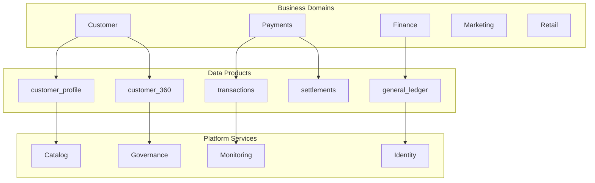
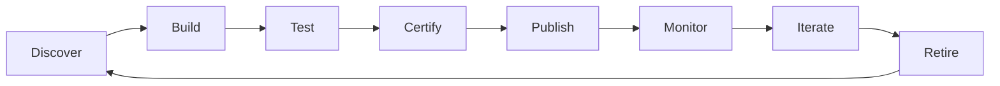
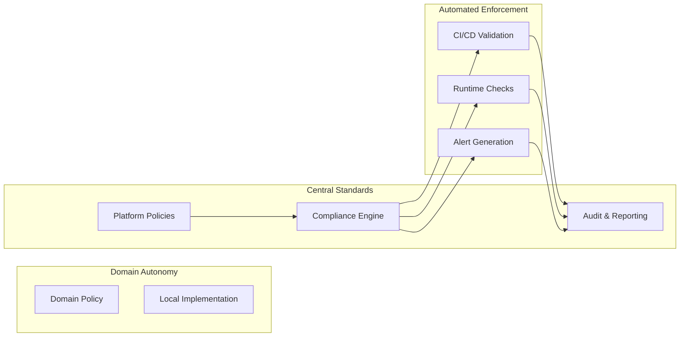
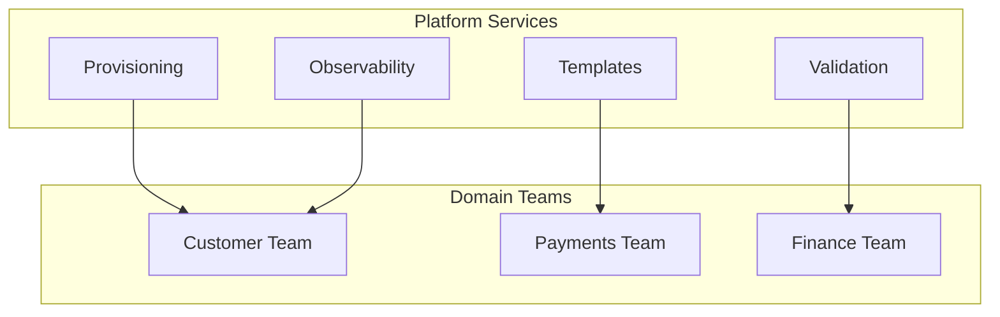
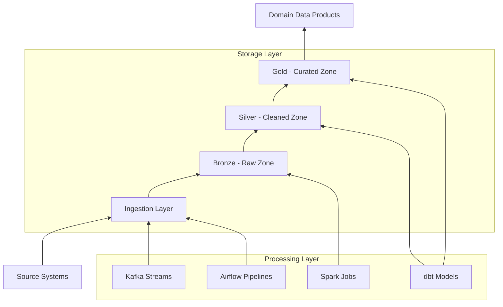
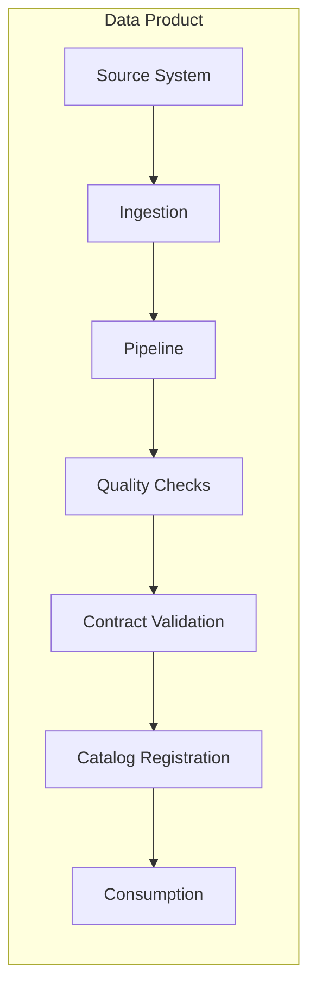
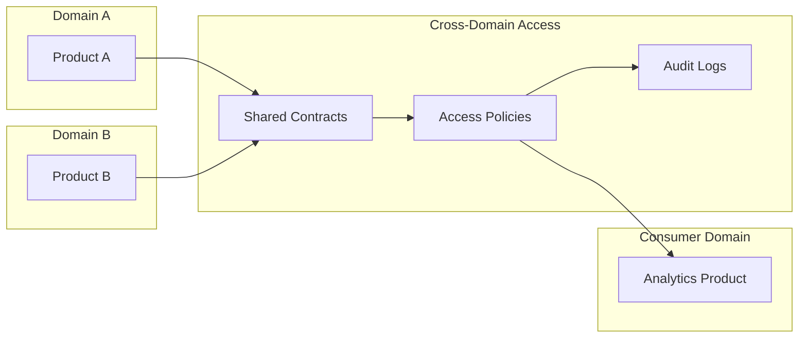

# Enterprise Data Mesh Architecture

## Overview

This document describes the enterprise-scale Data Mesh architecture implemented in this platform. The architecture follows the four core Data Mesh principles while incorporating production-grade patterns from leading enterprises.

## Architectural Principles

### Domain-Oriented Ownership

Domains are aligned with business capabilities, each owning their data end-to-end:

### Data as a Product

Each data product follows the product lifecycle:

### Federated Computational Governance

Governance is enforced through policies that are automatically validated:

### Self-Service Data Platform

Platform provides standardized interfaces and tooling:

## System Architecture

### Lakehouse Architecture

### Data Product Structure

Each data product follows a standardized pattern:

## Platform Components

### Catalog Service

Central registry for all data products:

- Product discovery
- Metadata management
- Lineage tracking
- Quality metrics
- Ownership information

### Governance Service

Policy enforcement and compliance:

- Schema validation
- Access control
- Retention policies
- Classification
- Audit logging

### Metadata Service

Metadata collection and management:

- Business metadata
- Technical metadata
- Operational metadata
- Lineage capture
- Impact analysis

### Contract Service

Data contract management:

- Schema definitions
- SLA/SLO definitions
- Version management
- Validation rules
- Compatibility checks

### Monitoring Service

Observability stack:

- Freshness metrics
- Quality metrics
- Consumer analytics
- SLA compliance
- Alert management

### Identity Service

Authentication and authorization:

- User management
- Group management
- Role assignments
- Secret management
- Audit trails

## Cross-Domain Integration

## Technology Mapping

| Component | Technology | Pattern |
|-----------|------------|---------|
| Storage | Delta Lake on ADLS/S3 | Lakehouse |
| Processing | Spark 4.x | Batch & Streaming |
| Streaming | Kafka + Structured Streaming | Event-driven |
| Orchestration | Airflow | Pipeline DAG |
| Transformation | dbt | ELT |
| Warehouse | Snowflake | Analytics |
| Catalog | Custom + OpenMetadata | Registry |
| Governance | Terraform + Custom | Policy-as-Code |
| Monitoring | Great Expectations + Custom | Observability |
| Security | Unity Catalog + Custom | IAM/RBAC |

## Scalability Patterns

- Horizontal partitioning by domain
- Independent deployment cycles
- Isolated failure domains
- Shared-nothing architecture
- Async communication patterns

## Reliability Patterns

- Circuit breakers
- Retry with exponential backoff
- Dead letter queues
- Idempotent operations
- Graceful degradation

## Security Patterns

- Zero-trust network
- Mutual TLS
- Token-based auth
- Row-level security
- Column-level masking