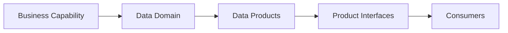
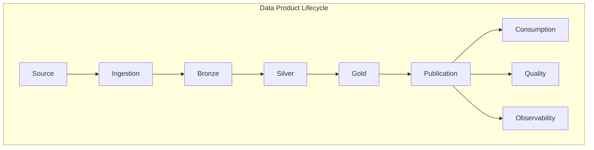
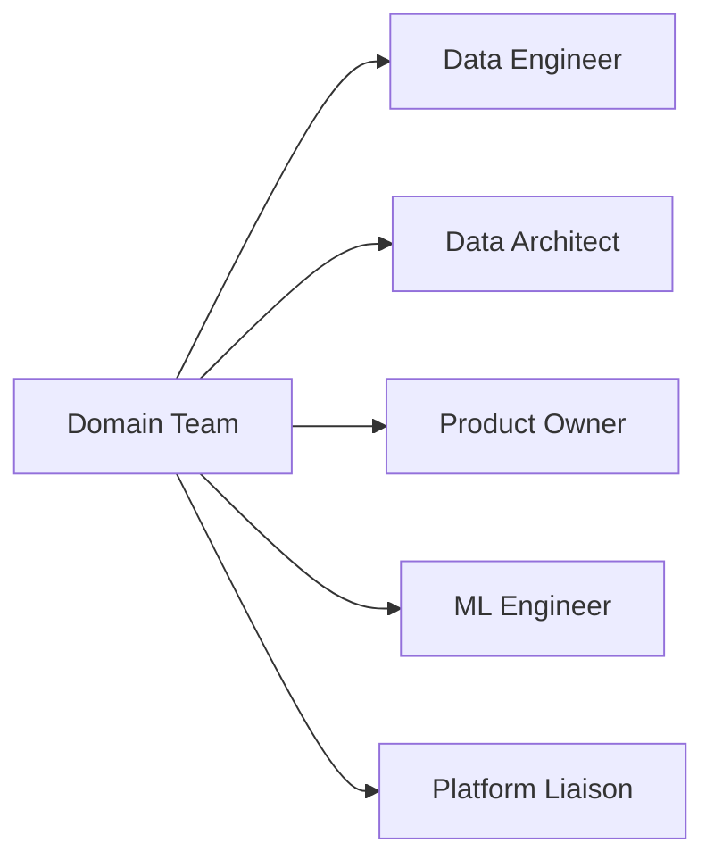
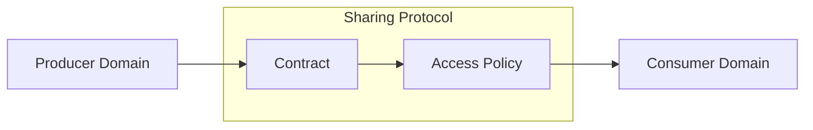

# Domain-Oriented Design

## Overview

Domain-oriented design aligns data architecture with business capabilities, enabling teams to own and operate their data products end-to-end.

## Domain Modeling Guide



## Domain Identification

### Criteria for Domain Boundaries

1. **Business Alignment**: Domain should map to a clear business capability
2. **Data Cohesion**: Data entities should share common semantics
3. **Ownership Clarity**: Single team should own the domain
4. **Change Velocity**: Related changes should be made together
5. **Consumer Grouping**: Similar consumers should access related data

### Common Enterprise Domains

| Domain | Business Context | Key Products |
|--------|-----------------|--------------|
| Customer | Customer experience & management | customer_profile, customer_360, segments |
| Payments | Payment processing & transactions | transactions, settlements, refunds |
| Finance | Financial reporting & planning | ledger, budgets, forecasts |
| Marketing | Campaign & attribution analytics | campaigns, attribution, roi |
| Retail | E-commerce & store operations | products, inventory, sales |
| Healthcare | Patient care & outcomes | patients, treatments, outcomes |
| Supply Chain | Logistics & inventory | suppliers, logistics, procurement |
| HR | Employee lifecycle | employees, compensation, performance |
| Analytics | Cross-domain insights | metrics, kpis, reports |

## Data Product Design

### Product Structure



### Product Components

#### 1. Source System
- Identify upstream systems
- Understand data semantics
- Define SLAs expectations

#### 2. Ingestion Layer
- Batch or streaming
- CDC or full load
- Schema extraction

#### 3. Bronze Zone
- Raw data landing
- Minimal transformation
- Schema enforcement

#### 4. Silver Zone
- Data cleaning
- Deduplication
- Standardization

#### 5. Gold Zone
- Business logic applied
- Aggregations
- Curated for consumers

#### 6. Publication
- Data contract definition
- Quality validation
- Catalog registration

## Domain Team Structure

### Team Composition



### Team Responsibilities

| Role | Responsibilities |
|------|-----------------|
| Data Engineer | Build & maintain pipelines |
| Data Architect | Design product architecture |
| Product Owner | Define requirements & SLAs |
| ML Engineer | Feature engineering & models |
| Platform Liaison | Platform integration & compliance |

## Data Product Contracts

### Contract Definition

```yaml
apiVersion: datamesh/v1
kind: DataProduct
metadata:
  name: customer_profile
  domain: customer
  owner: customer-team@example.com
  version: 1.0.0
spec:
  description: "Master customer profile data"
  schema:
    fields:
      - name: customer_id
        type: string
        required: true
        pii: false
      - name: email
        type: string
        required: true
        pii: true
  sla:
    freshness: 24h
    availability: 99.9%
  quality:
    expectations:
      - completeness: threshold 99.5%
      - uniqueness: threshold 100%
  access:
    roles:
      - customer_admin
      - marketing_analyst
```

## Domain API Patterns

### REST API

```python
from fastapi import FastAPI
from pydantic import BaseModel

app = FastAPI(title="Customer Domain API")

@app.get("/products/customer_profile/v1/schema")
def get_schema():
    return {"fields": [...], "version": "1.0.0"}

@app.get("/products/customer_profile/v1/data")
def get_data(limit: int = 100):
    return customer_data.limit(limit).to_dict()
```

### SQL Interface

```sql
-- Product query interface
SELECT * FROM customer.customer_profile
WHERE created_date >= '2024-01-01'
```

### Streaming Interface

```python
from kafka import KafkaConsumer

consumer = KafkaConsumer(
    'customer.profile.events',
    bootstrap_servers=['kafka:9092'],
    value_deserializer=lambda x: json.loads(x)
)

for message in consumer:
    process_customer_event(message.value)
```

## Cross-Domain Sharing

### Sharing Patterns



### Implementation

```python
# Producer side
@data_product(name="customer_profile", domain="customer")
def publish_customer_profile():
    df = get_clean_customer_data()
    publish_to_exchange(df, topic="customer.profile.shared")

# Consumer side
@data_consumer(product="customer_profile", domain="customer")
def consume_customer_profile():
    df = subscribe_from_exchange(topic="customer.profile.shared")
    join_with_marketing_data(df)
```

## Domain Isolation

### Network Isolation

```hcl
resource "azurerm_virtual_network" "domain_vnet" {
  name = "${var.domain_name}-vnet"
  address_space = ["10.${var.domain_cidr}.0.0/16"]
}

resource "azurerm_subnet" "domain_subnet" {
  name = "${var.domain_name}-subnet"
  vnet_name = azurerm_virtual_network.domain_vnet.name
  address_prefixes = ["10.${var.domain_cidr}.1.0/24"]
}
```

### Data Isolation

```python
class DomainIsolation:
    def __init__(self, domain_name: str):
        self.domain_name = domain_name
        self.storage_path = f"/domains/{domain_name}/"

    def enforce_path(self, operation: str) -> bool:
        """Ensure operations stay within domain boundaries."""
        return operation.startswith(self.storage_path)
```

## Domain SLAs

### SLA Definition Template

```yaml
slas:
  customer_profile:
    freshness:
      target: 24h
      alert: 36h
      breach: 48h
    quality:
      target: 99%
      alert: 95%
      breach: 90%
    availability:
      target: 99.9%
      alert: 99.5%
      breach: 99.0%
```

## Best Practices

1. Keep domains aligned with business capabilities
2. Design products for clear ownership
3. Implement contracts before building
4. Monitor cross-domain dependencies
5. Document domain boundaries clearly
6. Regular domain architecture reviews