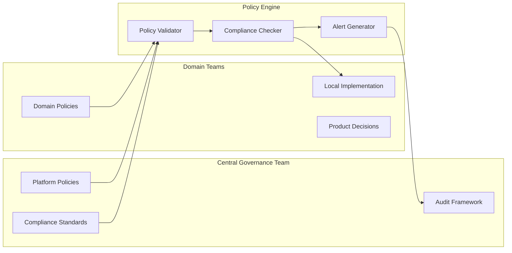
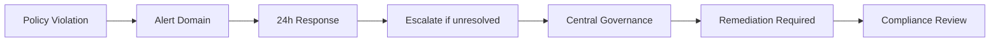

# Federated Computational Governance

## Overview

Federated governance enables decentralized data ownership while maintaining enterprise-wide compliance through automated policy enforcement.

## Governance Model



## Policy Types

### 1. Schema Policies

```yaml
schemas:
  customer_profile:
    policy:
      type: schema_evolution
      versioning: semantic
      compatibility: backward
      validation: strict
    rules:
      - required_fields: [customer_id, email, created_at]
      - allow_additive_changes: true
      - max_columns_change: 5%
```

### 2. Access Policies

```yaml
access:
  customer_pii:
    policy:
      pii_fields: [ssn, credit_card, dob]
      masking_required: true
      access_roles: [customer_admin, compliance_auditor]
      audit_logging: true
```

### 3. Retention Policies

```yaml
retention:
  transaction_data:
    policy:
      days: 3650
      archival_after: 90
      deletion_quarantine: 30
```

### 4. Quality Policies

```yaml
quality:
  minimum_score: 95
  required_tests:
    - completeness: threshold 99%
    - uniqueness: threshold 100%
    - freshness: threshold 24h
```

## Policy-as-Code Implementation

### Policy Definition Language

```python
from dataclasses import dataclass
from enum import Enum
from typing import Any

class PolicyType(Enum):
    SCHEMA = "schema"
    ACCESS = "access"
    RETENTION = "retention"
    QUALITY = "quality"

@dataclass
class DataPolicy:
    id: str
    domain: str
    policy_type: PolicyType
    rules: dict[str, Any]
    enforcement: str  # prevent, alert, audit
    version: str

    def validate(self, data_product: "DataProduct") -> "PolicyResult":
        """Validate data product against policy rules."""
        ...
```

### Policy Enforcement

```python
from policy_engine import PolicyEngine

def enforce_policies(product: DataProduct) -> bool:
    """Apply all applicable policies to a data product."""
    engine = PolicyEngine()
    policies = engine.get_policies_for_domain(product.domain)

    results = []
    for policy in policies:
        result = policy.validate(product)
        results.append(result)

        if result.severity == "critical" and not result.passed:
            raise PolicyViolation(f"Policy {policy.id} failed")

    return all(r.passed for r in results)
```

## Compliance Framework

### Compliance Levels

| Level | Requirements | Validation |
|-------|--------------|------------|
| bronze | Basic schema, ownership | Automated |
| silver | Quality tests, documentation | Semi-automated |
| gold | SLA/SLO, monitoring, security | Manual review |

### Compliance Scoring

```python
def calculate_compliance_score(product: DataProduct) -> float:
    """Calculate compliance score for a data product."""
    weights = {
        "schema": 0.25,
        "quality": 0.25,
        "documentation": 0.15,
        "monitoring": 0.20,
        "security": 0.15,
    }

    scores = {}
    for key, weight in weights.items():
        scores[key] = evaluate_aspect(product, key)

    return sum(scores[k] * weights[k] for k in weights)
```

## Audit & Reporting

### Audit Trail

```json
{
  "audit_event": {
    "timestamp": "2024-01-15T10:30:00Z",
    "event_type": "schema_change",
    "domain": "customer",
    "product": "customer_profile",
    "user": "data_engineer",
    "action": "column_added",
    "details": {
      "column": "customer_segment",
      "policy_result": "passed"
    }
  }
}
```

### Compliance Report

```python
class ComplianceReport:
    def __init__(self, domain: str, period: str):
        self.domain = domain
        self.period = period
        self.policies_evaluated = 0
        self.policies_passed = 0
        self.policies_failed = 0
        self.violations: list[Violation] = []

    def generate_summary(self) -> dict:
        return {
            "compliance_rate": self.policies_passed / self.policies_evaluated,
            "critical_violations": len([v for v in self.violations if v.severity == "critical"]),
            "warnings": len([v for v in self.violations if v.severity == "warning"]),
        }
```

## Governance Automation

### CI/CD Integration

```yaml
governance_checks:
  security_scan:
    runs-on: ubuntu-latest
    steps:
      - uses: data-mesh/security-check@v1
        with:
          domain: ${{ matrix.domain }}

  contract_validation:
    runs-on: ubuntu-latest
    steps:
      - uses: data-mesh/contract-validator@v1
        with:
          product_yaml: ${{ github.workspace }}/product.yaml

  quality_assurance:
    runs-on: ubuntu-latest
    steps:
      - uses: data-mesh/quality-gate@v1
        with:
          minimum_score: 95
```

### Runtime Validation

```python
@validate_policy
def read_data(product_id: str, consumer: str) -> DataFrame:
    """Read data with policy enforcement."""
    product = catalog.get(product_id)
    policy = governance.get_access_policy(product_id)

    if not policy.allows(consumer):
        raise AccessDenied(f"{consumer} cannot access {product_id}")

    return product.read()
```

## Governance Roles

### Central Governance Team

- Defines platform policies
- Maintains compliance framework
- Conducts audits
- Provides tooling

### Domain Governance Champions

- Implement domain policies
- Ensure local compliance
- Communicate with central team
- Handle exceptions

## Violation Handling

### Escalation Path



### Remediation Workflow

1. Violation detected
2. Alert sent to domain team
3. 24-hour response window
4. Fix or exception request
5. Compliance verification
6. Close violation

## Data Classification

### Classification Levels

| Level | Description | Controls |
|-------|-------------|----------|
| public | No restrictions | None |
| internal | Company use | RBAC |
| confidential | Sensitive data | ABAC + Masking |
| restricted | Highly sensitive | Strict RBAC + Audit |

### Classification Engine

```python
class DataClassifier:
    def classify(self, schema: Schema) -> Classification:
        """Automatically classify data based on content."""
        classifier = ml_classifier.load("data_classifier_v1")
        return classifier.predict(schema)

    def apply_controls(self, data: DataFrame, classification: Classification) -> DataFrame:
        """Apply appropriate controls based on classification."""
        if classification == Classification.CONFIDENTIAL:
            return self.apply_masking(data)
        return data
```

## Best Practices

1. Write policies as code, not documentation
2. Automate validation wherever possible
3. Make policies discoverable and testable
4. Provide clear violation messages
5. Enable policy versioning
6. Track policy effectiveness metrics