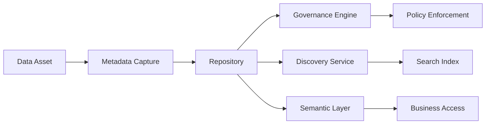
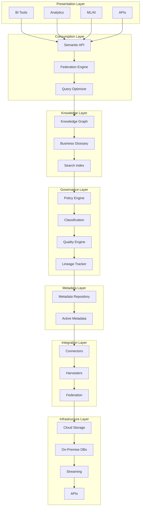
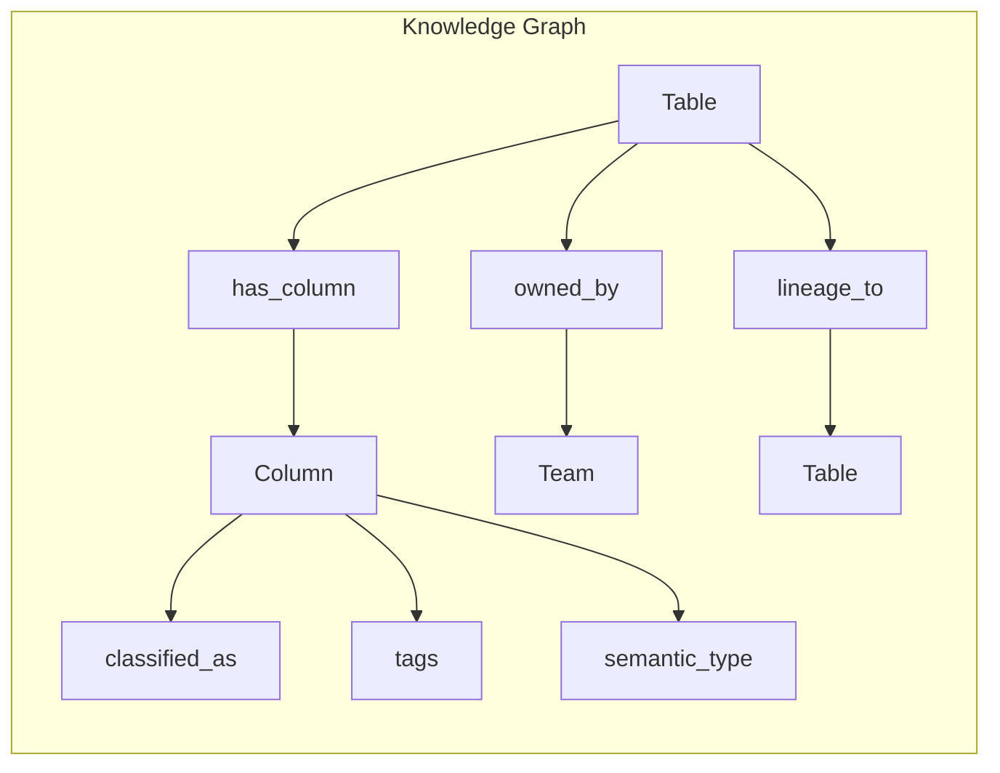
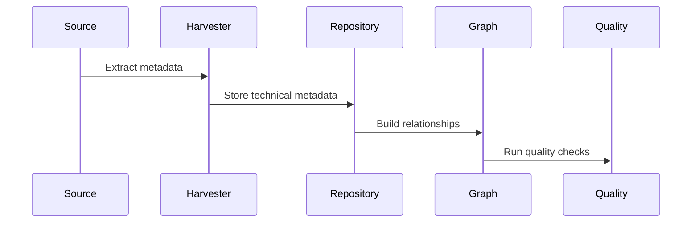
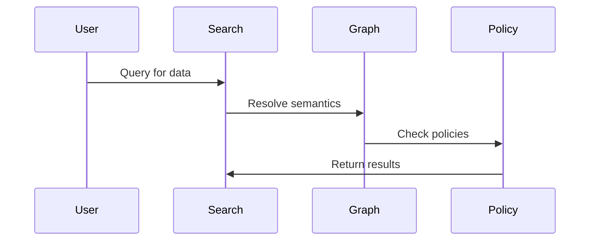
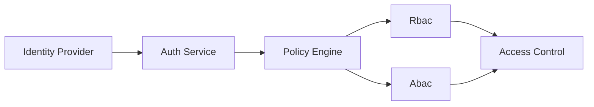

# Enterprise Data Fabric Architecture

## Overview

The Enterprise Data Fabric implements a metadata-driven architecture that provides unified data access, governance, and intelligence across hybrid and multi-cloud environments.

## Core Architecture Principles

### 1. Metadata-First Design

All data assets are represented through rich metadata that drives discovery, governance, and access decisions.



### 2. Active Metadata

Metadata is continuously updated through automated processes and real-time signals.

### 3. Semantic Abstraction

Business semantics are decoupled from technical implementations through semantic models.

### 4. Policy Automation

Governance policies are automatically enforced based on metadata classifications.

## Layered Architecture



## Metadata Types

### Technical Metadata

Captures technical characteristics of data assets:
- Schema definitions
- Data types
- Constraints
- Partitions
- Indexes
- Storage format

### Business Metadata

Captures business context and meaning:
- Business definitions
- Ownership
- Sensitivity
- Criticality
- Terms mapping

### Operational Metadata

Captures operational characteristics:
- Access patterns
- Usage statistics
- Performance metrics
- Lineage events

## Knowledge Graph Model



## Data Flow Patterns

### Ingest Pattern



### Discovery Pattern



## Platform Services

| Service | Port | Purpose |
|---------|------|---------|
| Metadata Service | 8080 | Metadata CRUD operations |
| Catalog Service | 8081 | Asset discovery and search |
| Glossary Service | 8082 | Business term management |
| Lineage Service | 8083 | Lineage processing |
| Policy Service | 8084 | Governance enforcement |
| Search Service | 8085 | Intelligent search |

## Scalability Patterns

### Horizontal Scaling

- Metadata harvesters can scale independently
- Search indexes are sharded by domain
- Knowledge graph uses distributed storage

### High Availability

- Multi-region metadata replication
- Active-passive service failover
- Circuit breaker patterns for connectors

## Security Architecture



## Deployment Architecture

```mermaid
flowchart LR
    subgraph "Kubernetes Cluster"
        A[API Services]
        B[Metadata Workers]
        C[Search Indexes]
        D[Graph Database]
        E[Cache Layer]
    end

    subgraph "External"
        F[Cloud Providers]
        G[On-Premise]
        H[Event Bus]
    end

    A --> B
    A --> C
    A --> D
    A --> E
    B --> F
    B --> G
    C --> H