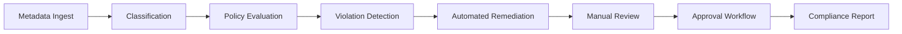
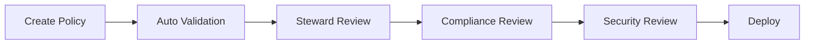

# Data Fabric Governance Framework

## Overview

The Data Fabric governance framework implements automated, policy-driven governance across hybrid and multi-cloud data ecosystems through policy-as-code and AI-assisted classification.

## Core Governance Principles

### 1. Policy-as-Code

All governance policies are defined as version-controlled code that can be automatically validated and deployed.

```python
class Policy:
    """Governance policy defined as code."""

    id: str
    name: str
    description: str
    rules: list[Rule]
    severity: SeverityLevel
    enabled: bool = True

class Rule:
    """Individual policy rule."""

    condition: str  # Expression to evaluate
    action: Action   # Action to take on violation
    remediation: str | None
```

### 2. Classification-Based Enforcement

Policies are automatically applied based on asset classifications derived from metadata.

### 3. Automated Remediation

Governance violations trigger automated remediation workflows where possible.

## Policy Types

### Data Classification Policies

```yaml
policy:
  id: "classification-pii"
  name: "PII Classification"
  description: "Detect and tag PII data"
  type: "classification"
  rules:
    - condition: "column.name matches '*ssn*' or '*social*'"
      classification: "PII"
      action: "tag_and_notify"
    - condition: "column.name matches '*email*'"
      classification: "PII"
      action: "tag_and_mask"
```

### Access Control Policies

```yaml
policy:
  id: "access-finance"
  name: "Finance Data Access"
  description: "Restrict access to finance data"
  type: "access"
  rules:
    - condition: "asset.domain == 'finance'"
      roles_allowed: ["finance_team", "data_steward"]
      action: "enforce_rbac"
```

### Retention Policies

```yaml
policy:
  id: "retention-raw"
  name: "Raw Data Retention"
  description: "Manage raw data retention"
  type: "retention"
  rules:
    - condition: "asset.type == 'raw'"
      retention_days: 90
      action: "archive_then_delete"
```

### Quality Policies

```yaml
policy:
  id: "quality-completeness"
  name: "Data Completeness"
  description: "Ensure data completeness"
  type: "quality"
  rules:
    - condition: "asset.quality_score < 0.95"
      action: "notify_owner"
```

## Governance Automation Flow



## Compliance Framework

### Compliance Dimensions

| Dimension | Metrics | Target |
|-----------|---------|--------|
| Policy Coverage | % assets with policies | 100% |
| Violation Rate | Violations per asset | <5% |
| Remediation Time | Avg time to fix | <24h |
| Classification Accuracy | Correct classifications | >95% |

### Compliance Reporting

```python
class ComplianceReport:
    """Compliance report for governance dashboard."""

    period: str
    asset_count: int
    policy_violations: list[Violation]
    compliance_score: float
    remediation_status: dict[str, int]

    def generate_score(self) -> float:
        """Calculate overall compliance score."""
        if not self.policy_violations:
            return 100.0
        return (self.asset_count - len(self.policy_violations)) / self.asset_count * 100
```

## Data Classification Engine

### Classification Rules

| Type | Pattern | Example |
|------|---------|---------|
| PII | Social Security, Email | ssn, email_address |
| PHI | Medical, Health | patient_id, diagnosis |
| Financial | Payment, Transaction | credit_card, account |
| Confidential | Internal, Sensitive | employee_data, salary |

### AI Classification

Uses LLM-based classification for automatic tagging:

```python
class AIClassifier:
    """AI-powered data classification."""

    def classify_column(self, column_metadata: dict) -> list[str]:
        """Classify column using AI models."""
        pass

    def classify_asset(self, asset_metadata: dict) -> ClassificationResult:
        """Classify entire asset."""
        pass
```

## Policy Enforcement Points

### At Ingestion

- Validate schema compliance
- Apply initial classifications
- Set ownership metadata

### At Query Time

- Check access policies
- Apply data masking
- Log access patterns

### At Runtime

- Monitor for drift
- Detect anomalies
- Trigger alerts

## Governance Services

| Service | Purpose |
|---------|---------|
| Policy Engine | Evaluate and enforce policies |
| Classification | Auto-detect data types |
| Lineage Tracker | Track data flow |
| Quality Monitor | Monitor data quality |
| Audit Logger | Track all changes |

## Policy Versioning

All policies follow semantic versioning:

```yaml
version: "1.2.0"
policy_id: "classification-pii"
changes:
  - version: "1.2.0"
    change: "Added healthcare ID patterns"
  - version: "1.1.0"
    change: "Added credit card patterns"
```

## Approval Workflows

### Multi-Stage Approval



### Rollback Capability

Policies can be automatically rolled back on critical violations:

```python
class PolicyRollout:
    """Manage policy rollouts with rollback."""

    def deploy(self, policy: Policy) -> bool:
        """Deploy policy with health checks."""
        if self.health_check() < 0.95:
            self.rollback()
            return False
        return True