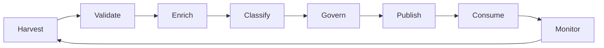
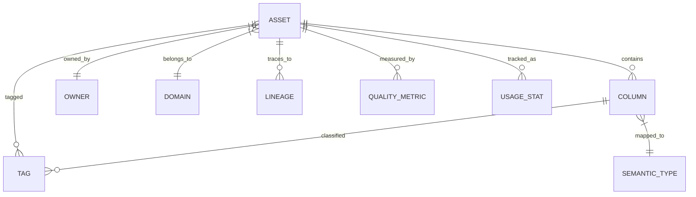

# Metadata Architecture

## Overview

This document details the metadata architecture patterns implemented in the Enterprise Data Fabric platform.

## Metadata Taxonomy

### Three Types of Metadata

| Layer | Description | Examples |
|-------|-------------|----------|
| Technical | Structural and technical characteristics | Schema, tables, columns, data types, partitions |
| Business | Business context and meaning | Terms, definitions, owners, sensitivities |
| Operational | Usage and operational metrics | Access patterns, performance, lineage |

## Metadata Lifecycle



## Metadata Repository Design

### Entity-Relationship Model



### Asset Model

```python
class DataAsset:
    """Base asset model for all metadata entities."""
    
    id: UUID
    urn: str
    name: str
    description: str
    asset_type: AssetType
    platform: str
    created_at: datetime
    updated_at: datetime
    owner: str
    domain: str
    sensitivity: SensitivityLevel
    quality_score: float
    freshness: datetime
    tags: list[str]
    glossary_terms: list[str]
```

## Active Metadata Patterns

### Real-time Metadata Updates

```python
class MetadataEvent:
    """Real-time metadata event for active updates."""
    
    event_type: EventType
    asset_id: UUID
    timestamp: datetime
    source: str
    payload: dict
    processed: bool = False
```

### Metadata Change Detection

- Schema drift detection
- Ownership changes
- Sensitivity reclassification
- Quality degradation alerts

## Knowledge Graph Integration

### Node Types

- **Asset Nodes**: Tables, Views, Streams, Models
- **Entity Nodes**: Business entities, Concepts
- **Owner Nodes**: Teams, Users, Departments
- **Term Nodes**: Glossary terms

### Relationship Types

- `HAS_COLUMN`: Asset → Column
- `OWNED_BY`: Asset → Owner
- `LINEAGE_TO`: Asset → Asset
- `CLASSIFIED_AS`: Asset → Classification
- `SEMANTIC_TYPE`: Column → Term
- `SIMILAR_TO`: Asset → Asset

## Metadata Federation

### Cross-Platform Synchronization

```python
class MetadataFederation:
    """Federate metadata across platforms."""
    
    def sync_platform(self, platform: str) -> int:
        """Sync metadata from a specific platform."""
        pass
    
    def resolve_conflicts(self, conflicts: list[Conflict]) -> list[Resolution]:
        """Resolve metadata conflicts between sources."""
        pass
```

### Conflict Resolution Strategies

1. **Timestamp-based** - Most recent wins
2. **Priority-based** - Higher priority source wins
3. **Merge-based** - Combine attributes
4. **Manual** - Require human resolution

## Metadata Quality Framework

### Quality Dimensions

| Dimension | Description | Score Range |
|-----------|-------------|-----------|
| Completeness | Required attributes present | 0-100 |
| Accuracy | Values match reality | 0-100 |
| Consistency | Cross-source agreement | 0-100 |
| Timeliness | Freshness of metadata | 0-100 |
| Uniqueness | No duplicate assets | 0-100 |
| Validity | Conforms to schema | 0-100 |

## Metadata APIs

### REST Endpoints

```
GET    /api/v1/metadata/assets          # List assets
GET    /api/v1/metadata/assets/{id}     # Get asset
POST   /api/v1/metadata/assets          # Create asset
PUT    /api/v1/metadata/assets/{id}     # Update asset
DELETE /api/v1/metadata/assets/{id}     # Delete asset

GET    /api/v1/metadata/search          # Search assets
GET    /api/v1/metadata/lineage/{id}    # Get lineage
GET    /api/v1/metadata/policies/{id}   # Get policies
```

## Metadata Storage Patterns

### Graph Storage

Neo4j-based storage for relationship-heavy queries:
- Asset relationships
- Business lineage
- Similarity clustering

### Document Storage

MongoDB-based storage for flexible schema:
- Asset metadata
- Historical changes
- Audit trails

### Search Index

Elasticsearch for full-text search:
- Asset names
- Descriptions
- Tags
- Glossary terms

## Metadata Automation

### Crawling Patterns

- Scheduled crawls
- Event-driven updates
- Change data capture
- API polling

### Classification Automation

- ML-based classification
- Rule-based tagging
- Business term inference
- Sensitivity detection