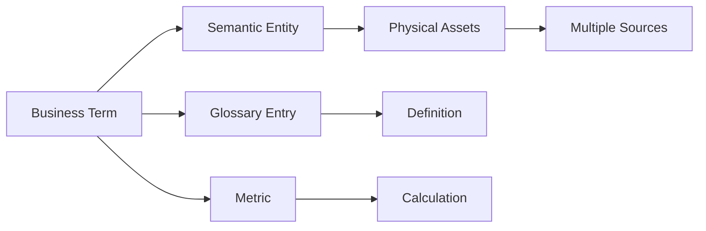
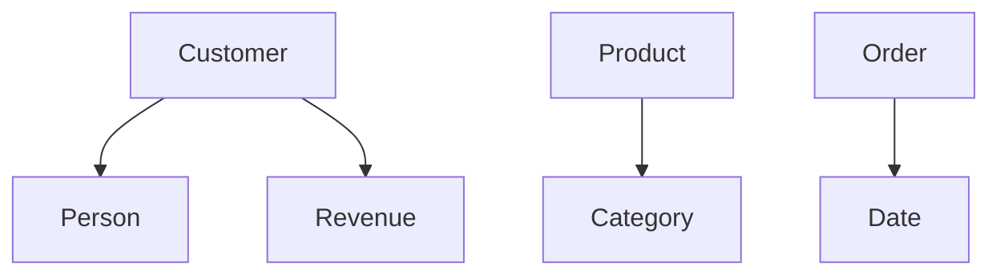

# Semantic Layer Architecture

## Overview

The semantic layer provides business-friendly abstractions over technical data assets, enabling self-service analytics and governance-driven data access.

## Semantic Layer Principles

### 1. Business-Natural Language

Users query data using business terms instead of technical schemas.

### 2. Unified Business Vocabulary

Single source of truth for business definitions across all platforms.

### 3. Context-Aware Access

Semantic rules adapt based on user context and policies.

## Semantic Model Structure



## Entity Types

### Business Entity

```python
class BusinessEntity:
    """Business entity in semantic layer."""

    id: str
    name: str
    description: str
    domain: str
    owners: list[Owner]
    attributes: list[Attribute]
    relations: list[Relation]

class Attribute:
    """Entity attribute mapping."""

    name: str
    semantic_type: SemanticType
    source_columns: list[ColumnMapping]
    transformations: list[str]
```

### Metric Definition

```python
class Metric:
    """Business metric definition."""

    id: str
    name: str
    description: str
    calculation: str  # SQL or expression
    dimensions: list[str]
    granularity: Granularity
    owners: list[Owner]
```

## Semantic Mapping Patterns

### One-to-One Mapping

Single business entity maps to single physical table.

### One-to-Many Mapping

Single business entity aggregates multiple source tables.

### Many-to-One Mapping

Multiple business views from single physical table.

## Semantic API

### Query Interface

```python
class SemanticQuery:
    """Business-friendly query interface."""

    def query_entity(self, entity_name: str, filters: dict) -> DataFrame:
        """Query using business entity name."""
        pass

    def query_metric(
        self,
        metric_name: str,
        dimensions: list[str],
        filters: dict
    ) -> DataFrame:
        """Query using business metric."""
        pass
```

### REST API

```
GET    /api/v1/semantic/entities           # List entities
GET    /api/v1/semantic/entities/{name}    # Get entity definition
POST   /api/v1/semantic/query              # Execute semantic query
GET    /api/v1/semantic/metrics            # List metrics
GET    /api/v1/semantic/terms              # List glossary terms
```

## Term Mapping

### Business Term Registry

```python
class BusinessTerm:
    """Registered business term."""

    id: str
    name: str
    definition: str
    synonyms: list[str]
    related_terms: list[str]
    mapped_columns: list[Column]
    stewards: list[Steward]
```

### Term Discovery

Auto-discover potential term mappings from existing assets.

## Semantic Model Examples

### Customer Entity

| Business Attribute | Source Column | Transformation |
|-------------------|---------------|----------------|
| Customer Name | customer_name | none |
| Email Address | email | mask PII |
| Customer Tier | tier_score | case when score > 90 then 'Platinum' |
| Lifetime Value | total_revenue | sum(orders) |

### Revenue Metric

```python
class RevenueMetric(Metric):
    """Revenue metric definition."""

    calculation = "SUM(order_amount) - SUM(discount)"
    dimensions = ["date", "product", "region", "customer"]
    granularity = Granularity.DAILY
```

## Semantic Validation

### Field Validation

- Data type compatibility
- Value range checks
- Business rule validation

### Query Validation

- Policy compliance check
- Access control enforcement
- Audit logging

## Semantic Versioning

Models are versioned to track changes:

```yaml
version: "2.1.0"
entity: "customer"
changes:
  - field: "customer_tier"
    change: "Added Gold tier"
  - field: "lifetime_value"
    change: "Added transformation logic"
```

## Cross-Platform Semantics

### Unified Entity Across Clouds

```python
class MultiCloudEntity(BusinessEntity):
    """Entity spanning multiple cloud platforms."""

    mappings: dict[str, PlatformMapping]

    def get_mapping(self, platform: str) -> PlatformMapping:
        """Get mapping for specific platform."""
        pass
```

### Platform-Specific Overrides

Different transformations per platform while maintaining semantics.

## Business Glossary Integration

### Term Relationships



## Semantic Lineage

Track how semantic models relate to physical assets and each other.

## API Contracts

Generate API contracts from semantic models for downstream consumption.

## Testing

### Contract Tests

Validate semantic models against source data.

### Regression Tests

Ensure semantic changes don't break existing queries.