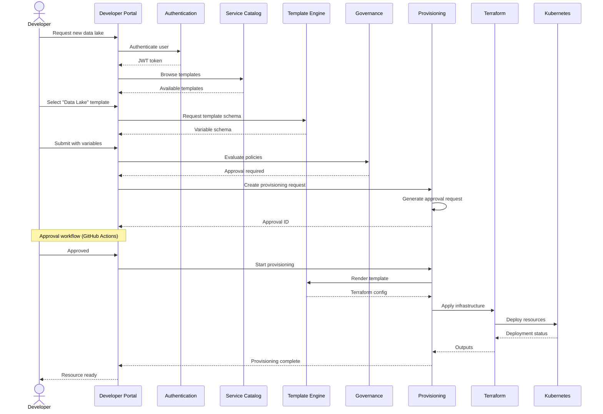

# Enterprise Platform Engineering Architecture

## Executive Summary

This document describes the enterprise-grade Internal Developer Platform (IDP) architecture for data and AI teams. The platform enables self-service infrastructure, pipelines, data products, and AI services through golden paths, templates, and automated workflows.

## Architecture Overview

### Core Principles

1. **Self-Service First** - Developers can provision resources without platform team intervention
2. **Golden Paths** - Pre-approved, production-ready templates for common use cases
3. **Governance by Design** - Policies enforced at every layer
4. **Multi-Tenancy** - Isolated environments per team
5. **Observability** - Complete visibility into platform operations

### System Architecture

```
┌─────────────────────────────────────────────────────────────────────┐
│                      Developer Experience Layer                      │
├─────────────────────────────────────────────────────────────────────┤
│  Developer Portal │ Platform CLI │ SDK │ Documentation │ Support    │
└─────────────────────────────────────────────────────────────────────┘
                                    │
                                    ▼
┌─────────────────────────────────────────────────────────────────────┐
│                        API Gateway Layer                             │
├─────────────────────────────────────────────────────────────────────┤
│  Authentication │ RBAC │ Rate Limiting │ Audit Logging │ SSL/TLS    │
└─────────────────────────────────────────────────────────────────────┘
                                    │
                                    ▼
┌─────────────────────────────────────────────────────────────────────┐
│                      Platform Services Layer                         │
├─────────────────────────────────────────────────────────────────────┤
│  Service Catalog │ Template Engine │ Provisioning │ Governance      │
│  Approval Workflow │ Policy Engine │ Audit Service │ Cost Management│
└─────────────────────────────────────────────────────────────────────┘
                                    │
                                    ▼
┌─────────────────────────────────────────────────────────────────────┐
│                     Infrastructure Layer                             │
├─────────────────────────────────────────────────────────────────────┤
│  Terraform │ Kubernetes │ Cloud Providers │ CI/CD │ GitOps           │
└─────────────────────────────────────────────────────────────────────┘
                                    │
                                    ▼
┌─────────────────────────────────────────────────────────────────────┐
│                        Data Layer                                    │
├─────────────────────────────────────────────────────────────────────┤
│  PostgreSQL │ Redis │ Vault │ Object Storage │ Message Queues        │
└─────────────────────────────────────────────────────────────────────┘
```

## Key Components

### 1. Developer Portal

**Purpose**: Central hub for developers to discover and request platform services

**Features**:
- Service catalog with search and filtering
- Golden path templates
- Self-service provisioning workflows
- Documentation and tutorials
- Developer dashboard with metrics

**Technology**:
- Frontend: React with TypeScript
- Backend: FastAPI
- Authentication: OAuth2 + JWT

### 2. Service Catalog

**Purpose**: Registry of all platform services with metadata and relationships

**Data Model**:
```python
Service {
  id: string
  name: string
  category: string (data-platform, ai-platform, infrastructure)
  description: string
  version: string
  owner_team: string
  status: enum (active, deprecated, draft)
  tags: list[string]
  dependencies: list[ServiceDependency]
  documentation_url: string
  api_endpoint: string
}
```

**API Endpoints**:
- `GET /api/v1/services` - List all services
- `POST /api/v1/services` - Register new service
- `GET /api/v1/services/{id}` - Get service details
- `PUT /api/v1/services/{id}` - Update service
- `DELETE /api/v1/services/{id}` - Deregister service

### 3. Template Engine

**Purpose**: Golden path templates for standardized resource provisioning

**Features**:
- Jinja2-based templating
- Variable validation with JSON Schema
- Template versioning
- Usage tracking and analytics
- Template categories (data-lake, streaming, ml-pipeline, etc.)

**Template Structure**:
```
template-id/
├── template.yaml          # Template metadata and schema
├── README.md             # Template documentation
├── main.tf               # Terraform configuration
├── k8s/                  # Kubernetes manifests
│   ├── deployment.yaml
│   ├── service.yaml
│   └── ingress.yaml
└── ci/                   # CI/CD pipeline
    └── github-actions.yml
```

**Example Template Schema**:
```yaml
name: "Data Lake with Medallion Architecture"
version: "1.0.0"
category: "data-platform"
description: "Production-ready data lake with bronze, silver, gold layers"

variables:
  - name: project_name
    type: string
    required: true
    validation:
      pattern: "^[a-z0-9-]+$"
      max_length: 30

  - name: environment
    type: string
    required: true
    enum: [dev, staging, prod]

  - name: storage_tier
    type: string
    required: false
    default: "standard"
    enum: [standard, premium]
```

### 4. Provisioning Service

**Purpose**: Automate infrastructure provisioning through standardized workflows

**Provisioning Flow**:
```
1. Developer selects template
   ↓
2. Policy validation (OPA/Sentinel)
   ↓
3. Approval workflow (if required)
   ↓
4. Template rendering with variables
   ↓
5. Terraform plan and apply
   ↓
6. Kubernetes deployment
   ↓
7. Health checks and validation
   ↓
8. Resource registration in catalog
   ↓
9. Monitoring and alerting setup
```

**State Machine**:
```
PENDING → VALIDATING → POLICY_CHECK → APPROVAL_PENDING →
APPROVED → PROVISIONING → DEPLOYING → COMPLETED
                                           ↓
                                         FAILED → ROLLBACK
```

**Database Schema**:
```sql
CREATE TABLE provisioning_requests (
  id UUID PRIMARY KEY,
  name VARCHAR(255) NOT NULL,
  template_id UUID NOT NULL,
  variables JSONB NOT NULL,
  status VARCHAR(50) NOT NULL,
  environment VARCHAR(50) NOT NULL,
  team VARCHAR(100) NOT NULL,
  requested_by VARCHAR(255) NOT NULL,
  terraform_config JSONB,
  kubernetes_manifests JSONB,
  output JSONB,
  created_at TIMESTAMP NOT NULL,
  completed_at TIMESTAMP
);
```

### 5. Governance Service

**Purpose**: Enforce policies, compliance, and audit requirements

**Policy Types**:
1. **Security Policies**
   - Encryption at rest required
   - No public S3 buckets
   - Minimum TLS version
   - Secrets in Vault only

2. **Cost Policies**
   - Maximum instance types
   - Budget limits per team
   - Auto-shutdown for dev environments

3. **Compliance Policies**
   - Data residency requirements
   - Retention policies
   - Access control requirements

4. **Operational Policies**
   - Monitoring required
   - Backup requirements
   - Naming conventions

**Policy Evaluation**:
```python
# OPA Rego policy example
package platform.s3

deny[msg] {
  input.resource.type == "AWS::S3::Bucket"
  not input.resource.properties.BucketEncryption
  msg := "S3 buckets must have encryption enabled"
}

deny[msg] {
  input.resource.type == "AWS::S3::Bucket"
  input.resource.properties.AccessControl == "AuthenticatedRead"
  msg := "S3 buckets cannot have authenticated read access"
}
```

### 6. Authentication & Authorization

**Authentication Flow**:
```
1. User credentials → OAuth2 token endpoint
   ↓
2. Validate credentials (bcrypt hash comparison)
   ↓
3. Generate JWT access token (30 min expiry)
   ↓
4. Generate refresh token (7 day expiry)
   ↓
5. Return tokens to client
   ↓
6. Client uses access token for API requests
   ↓
7. API gateway validates JWT
   ↓
8. Extract user roles and permissions
   ↓
9. Enforce RBAC on protected resources
```

**RBAC Model**:
```yaml
roles:
  platform-admin:
    permissions:
      - "*:*"

  data-engineer:
    permissions:
      - "data-platform:read"
      - "data-platform:write"
      - "airflow:read"
      - "airflow:write"
      - "kafka:read"
      - "kafka:write"

  ml-engineer:
    permissions:
      - "ml-platform:read"
      - "ml-platform:write"
      - "feature-store:read"
      - "model-serving:deploy"

  viewer:
    permissions:
      - "*:read"
```

## Infrastructure Architecture

### Azure Cloud Infrastructure

**Resource Hierarchy**:
```
Resource Group: enterprise-platform-rg
├── Virtual Network: platform-vnet
│   └── Subnet: platform-subnet
├── AKS Cluster: platform-aks-{env}
│   ├── System Node Pool (2-5 nodes)
│   └── User Node Pool (3-20 nodes)
├── PostgreSQL: platform-postgres-{env}
│   └── Database: platform
├── Redis Cache: platform-redis-{env}
├── Key Vault: platform-vault-{env}
├── Container Registry: platformacr{env}
└── Log Analytics: platform-logs-{env}
```

**Networking**:
- VNet: 10.0.0.0/16
- Subnet: 10.0.1.0/24
- Kubernetes service CIDR: 10.0.10.0/24
- DNS: 10.0.10.10

**Security**:
- Private endpoints for all services
- Azure AD integration for AKS
- RBAC enabled
- Network policies (Calico)
- Encryption at rest and in transit

### Kubernetes Architecture

**Namespaces**:
```
platform-system/          # Platform services
  ├── platform-api
  ├── platform-worker
  └── platform-monitoring

data-team/               # Data team workloads
ml-team/                 # ML team workloads
analytics-team/          # Analytics team workloads
```

**Resource Quotas** (per team):
```yaml
apiVersion: v1
kind: ResourceQuota
metadata:
  name: team-quota
spec:
  hard:
    requests.cpu: "20"
    requests.memory: 80Gi
    limits.cpu: "40"
    limits.memory: 160Gi
    pods: "100"
    services: "20"
    persistentvolumeclaims: "50"
```

## Data Flow

### Provisioning Workflow



### Multi-Tenancy Model

```
Tenant (Team)
├── Namespace (isolated)
├── Resource Quota
├── Network Policy
├── Service Account
└── RBAC Bindings

Isolation Mechanisms:
- Kubernetes Namespaces
- Network Policies (Calico)
- Resource Quotas
- RBAC
- Separate service accounts
```

## Observability

### Metrics

**Platform Metrics**:
- Provisioning success rate
- Template usage statistics
- API latency and error rates
- Resource utilization
- Cost per team

**Application Metrics**:
- Request rate
- Error rate
- Response time (p50, p95, p99)
- Database connection pool
- Cache hit rate

### Logging

**Structured Logging** (JSON format):
```json
{
  "timestamp": "2026-01-03T12:00:00Z",
  "level": "INFO",
  "service": "platform-api",
  "user_id": "user-123",
  "action": "provision_resource",
  "resource_id": "resource-456",
  "duration_ms": 1500,
  "status": "success"
}
```

### Tracing

- OpenTelemetry for distributed tracing
- Trace context propagated across services
- Integration with Azure Application Insights

## Security

### Authentication & Authorization

- OAuth2 with JWT tokens
- Azure AD integration
- RBAC with fine-grained permissions
- Service-to-service authentication

### Secrets Management

- Azure Key Vault for secrets
- Kubernetes sealed secrets
- Automatic rotation
- Audit logging for all access

### Network Security

- Private endpoints only
- Network policies
- Ingress with TLS termination
- DDoS protection

## Disaster Recovery

### Backup Strategy

- PostgreSQL: Daily automated backups, 7-day retention
- Terraform state: Geo-redundant storage
- Kubernetes: etcd backups
- Cross-region replication for production

### RTO/RPO

- Development: RTO 4h, RPO 24h
- Staging: RTO 2h, RPO 12h
- Production: RTO 1h, RPO 1h

## Cost Management

### Cost Allocation

- Tags on all resources (team, environment, project)
- Cost reporting per team
- Budget alerts at 80%, 90%, 100%

### Estimated Costs (Monthly)

| Resource | Dev | Staging | Production |
|----------|-----|---------|------------|
| AKS Cluster | $450 | $600 | $1200 |
| PostgreSQL | $120 | $200 | $500 |
| Redis Cache | $150 | $200 | $400 |
| Key Vault | $25 | $25 | $50 |
| Container Registry | $50 | $75 | $150 |
| Networking | $50 | $75 | $150 |
| **Total** | **$845** | **$1,175** | **$2,450** |

## Scalability

### Horizontal Scaling

- API servers: Auto-scale based on CPU/memory
- Workers: Queue-based auto-scaling
- Database: Read replicas for read-heavy workloads

### Performance Targets

- API response time: < 200ms (p95)
- Provisioning time: < 5 minutes
- Template rendering: < 30 seconds
- Dashboard load time: < 2 seconds

## Future Enhancements

1. **Multi-Cloud Support** - AWS and GCP providers
2. **Advanced Analytics** - ML-based cost optimization
3. **Self-Healing** - Automated issue detection and resolution
4. **Edge Computing** - Deploy workloads closer to users
5. **Serverless Integration** - Azure Functions, AWS Lambda

## References

- [Platform Engineering Guide](idp-guide.md)
- [Developer Experience](developer-experience.md)
- [Governance Policies](governance.md)
- [Deployment Guide](deployment-guide.md)
- [Troubleshooting](troubleshooting.md)